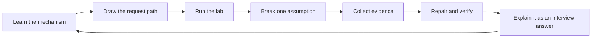

# Kubernetes Internals: 30-Day Production Mastery

An intensive, hands-on curriculum for senior DevOps, SRE, and Platform Engineering interviews. The course turns the topics in `topics.txt` into a daily path from control-plane internals to production incident response.

> **Daily commitment:** 2.5-3 hours: 60 minutes theory, 60-90 minutes lab, and 30 minutes troubleshooting/interview practice.

## What you will be able to do

- Trace a request from `kubectl` through authentication, admission, persistence, scheduling, kubelet, the container runtime, and networking.
- Explain Pods, Services, storage, controllers, scheduling, scaling, and security at implementation depth.
- Debug Pending, CrashLoopBackOff, OOMKilled, ImagePullBackOff, DNS, Service, Ingress, PVC, node, API server, and etcd failures.
- Make production decisions about high availability, upgrades, disruption budgets, observability, capacity, and safe rollout.
- Answer senior Kubernetes interview questions with a structured mechanism → evidence → mitigation explanation.

## Start here

1. Read [Lab setup](/docs/setup.md).
2. Review the [complete 30-day plan](/docs/course-plan.md).
3. Begin [Day 1: Cluster mental model](/docs/days/day-01.md).
4. Use the [command field guide](/docs/reference/commands.md) during every lab.
5. Record incidents with the template in the [production troubleshooting guide](/docs/reference/troubleshooting.md).

## Learning loop



## Course map

| Days | Area | Outcome |
|---|---|---|
| 1-7 | Architecture and control plane | Trace creation and failure paths end to end |
| 8-10 | Pods and scheduling | Explain isolation, lifecycle, placement, and preemption |
| 11-14 | Networking | Debug CNI, Services, DNS, Ingress, and policy |
| 15-18 | Storage and workloads | Select and operate the correct controller and volume model |
| 19-20 | Security | Apply least privilege and workload guardrails |
| 21-22 | Scaling and reliability | Scale on signals and preserve availability during disruption |
| 23-25 | Extensibility and observability | Understand controllers, CRDs, watches, and telemetry |
| 26-29 | Production operations | Diagnose real failure modes and operate clusters safely |
| 30 | Capstone and interviews | Prove the full workflow under time pressure |

## Documentation site

This repository is a static Docsify site and also reads cleanly as ordinary GitHub Markdown.

```console
python -m http.server 8000
```

Open `http://localhost:8000`. For GitHub Pages, publish the repository root from the default branch; `.nojekyll` is already included.

### Run with Docker

```console
docker build --tag kubernetes-internals .
docker run --detach --rm --name kubernetes-internals --publish 8000:80 kubernetes-internals
```

Open `http://localhost:8000`. Stop the container when finished:

```console
docker stop kubernetes-internals
```

## Lab safety

Course resources use the `k8s-30d` namespace unless a cluster-scoped concept requires otherwise. Do not run failure injection against a shared or production cluster. Confirm context before every lab:

```console
kubectl config current-context
kubectl cluster-info
kubectl get nodes
```

Install and clean lab resources through the course Helm release:

```console
helm upgrade --install k8s-30d labs/kubernetes-internals --namespace default
helm uninstall k8s-30d --namespace default
```

The release is stored in `default` and owns the separate `k8s-30d` course namespace. Review the chart and confirm your current context before installing it.

## Primary references

- [Kubernetes concepts](https://kubernetes.io/docs/concepts/)
- [Kubernetes components](https://kubernetes.io/docs/concepts/overview/components/)
- [Debug applications](https://kubernetes.io/docs/tasks/debug/debug-application/)
- [Production environment](https://kubernetes.io/docs/setup/production-environment/)
- [Kubernetes API reference](https://kubernetes.io/docs/reference/kubernetes-api/)
