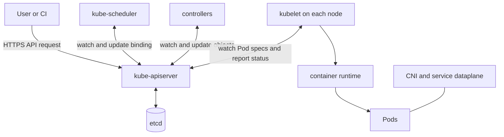

# Day 1 · Cluster mental model

## Outcome

Build a precise vocabulary for cluster, control plane, node, workload, declarative state, and reconciliation. By the end, you should locate a symptom in the correct layer before choosing a command.

## The model

Kubernetes is an API-driven control system. You submit **desired state** as API objects. Controllers compare that state with observations and act until the two converge. The API server is the coordination boundary; components do not normally edit each other's databases or command each other directly.



Important distinctions:

- A **cluster** is the control plane plus worker nodes.
- A **Pod** is the smallest scheduled API object, not a process and not merely a container.
- `spec` usually describes intent; `status` reports observation. Controllers bridge the gap.
- Labels identify and group objects. Selectors create relationships such as Service → Pods.
- Namespaces scope names and policy, but are not virtual clusters or strong security boundaries by themselves.

## Lab · Discover the API

```console
kubectl config current-context
kubectl cluster-info
kubectl get nodes -o wide
kubectl get namespaces
kubectl get pods -A -o wide
kubectl api-resources
kubectl api-versions
kubectl explain pod.spec --recursive
kubectl get --raw /version
```

Create the course namespace and a Pod imperatively, then inspect the stored object:

```console
helm upgrade --install k8s-30d labs/kubernetes-internals --namespace default
kubectl run first-pod -n k8s-30d --image=nginx:1.27-alpine
kubectl get pod first-pod -n k8s-30d -o yaml
kubectl describe pod first-pod -n k8s-30d
kubectl delete pod first-pod -n k8s-30d
```

In the YAML, find `metadata.uid`, `resourceVersion`, `spec.nodeName`, Pod IP, conditions, container state, owner references, and managed fields. Ask which component wrote each field.

## Break/fix drill

Use an impossible node label:

```console
kubectl run misplaced -n k8s-30d --image=nginx:1.27-alpine --overrides='{"spec":{"nodeSelector":{"training":"missing"}}}'
kubectl get pod misplaced -n k8s-30d
kubectl describe pod misplaced -n k8s-30d
kubectl get events -n k8s-30d --sort-by='.metadata.creationTimestamp'
kubectl delete pod misplaced -n k8s-30d
```

Expected reasoning: the API accepted and stored the Pod; the scheduler could not find a feasible node; no kubelet or runtime failure occurred.

## Production lens

| Symptom | Layer to test first | Evidence |
|---|---|---|
| `kubectl` cannot connect | client/API endpoint | context, DNS/TCP/TLS, API health |
| Pod Pending with no node | scheduler/constraints | Pod events, requests, affinity, taints |
| Pod assigned but containers absent | kubelet/runtime/CNI/storage | node conditions, kubelet/runtime events |
| Pod ready but Service fails | selector/EndpointSlice/dataplane | endpoints, port mapping, network policy |

Do not begin by restarting components. First identify the failed transition and preserve evidence.

## Interview practice

1. **Explain Kubernetes architecture.** Start with the declarative API, name control-plane and node components, then trace one object through reconciliation.
2. **Is Kubernetes a deployment tool?** It can deploy, but its deeper abstraction is a distributed control plane that continuously reconciles declared state.
3. **Why are `spec` and `status` separate?** They allow independent intent and observation, conflict-aware updates, and multiple reconcilers.
4. **Are namespaces security boundaries?** Not alone. Combine them with RBAC, NetworkPolicy, quotas, admission, and node/runtime isolation.

## Exit check

- Draw the diagram without notes.
- Explain where desired and observed state live.
- Classify a Pending Pod without blaming kubelet.
