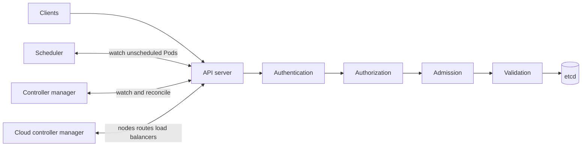

# Day 2 · Control-plane components

## Outcome

Understand the API server, etcd, scheduler, kube-controller-manager, and cloud-controller-manager as independently replaceable processes with distinct responsibilities.



## Responsibilities and failure behavior

- **kube-apiserver:** serves discovery and resource APIs, authenticates, authorizes, runs admission, validates, persists, and exposes watches. It is horizontally scalable and mostly stateless; etcd is its durable state.
- **etcd:** consistent key-value store for cluster API state. Quorum, latency, disk health, and correct backup are critical.
- **kube-scheduler:** filters and scores nodes for Pods without `spec.nodeName`, then records a binding. It does not start containers.
- **kube-controller-manager:** runs many reconciliation loops—Deployment/ReplicaSet, Node, EndpointSlice, Job, namespace, service account, garbage collection, and more.
- **cloud-controller-manager:** separates provider-dependent node, route, and load-balancer logic. Local clusters may not run one.

If the scheduler stops, existing workloads keep running and explicitly bound Pods can run, but new unscheduled Pods remain Pending. If controllers stop, direct API operations still work but replicas, endpoints, Jobs, and node lifecycle stop converging. If the API server is unreachable, nodes can keep existing containers running for a time, but cluster coordination and most changes stop.

## Lab · Inspect the control plane

```powershell
kubectl get pods -n kube-system -o wide
kubectl get --raw='/readyz?verbose'
kubectl get --raw='/livez?verbose'
kubectl get componentstatuses  # legacy and incomplete; compare with readyz
kubectl get leases -n kube-system
kubectl describe lease kube-controller-manager -n kube-system
kubectl describe lease kube-scheduler -n kube-system
```

On a kubeadm/Kind control-plane node, these components commonly run as static Pods. Inspect without changing them:

```powershell
kubectl get pod -n kube-system -l component=kube-apiserver -o yaml
kubectl logs -n kube-system -l component=kube-scheduler --tail=100
kubectl logs -n kube-system -l component=kube-controller-manager --tail=100
```

Managed distributions can hide control-plane Pods; use provider health metrics and audit/control-plane logs instead.

## Practical issue · A misleading health check

`kubectl get componentstatuses` may report stale or incomplete results because it relies on older component health behavior. Prefer API server `/livez` and `/readyz`, component metrics, leader-election Leases, and an actual write/read canary.

```powershell
kubectl create configmap api-canary -n k8s-30d --from-literal=timestamp=(Get-Date -Format o)
kubectl get configmap api-canary -n k8s-30d -o jsonpath='{.data.timestamp}'
kubectl delete configmap api-canary -n k8s-30d
```

## Production failure matrix

| Loss | Existing Pods | New Pods | Updates and healing |
|---|---|---|---|
| one API replica | normally unaffected behind a healthy LB | unaffected | unaffected if capacity remains |
| all API replicas | keep running locally | API creation unavailable | reconciliation/status reporting stops |
| scheduler | keep running | remain Pending unless already bound | controllers may create Pods but not place them |
| controller manager | keep running | direct Pod creates can schedule | replica healing and many lifecycles stall |
| etcd quorum | keep running on nodes | API writes fail | control plane cannot persist convergence |

## Interview practice

1. **Why is the API server the heart of Kubernetes?** It is the authenticated, policy-enforced coordination and persistence interface used by all reconcilers.
2. **Can Pods run without the control plane?** Existing containers can continue, subject to local kubelet/runtime behavior; new scheduling, reconciliation, API operations, and reliable state coordination cannot.
3. **What if the scheduler is down?** Existing Pods are unaffected; unscheduled Pods accumulate. Restore scheduler availability, examine leader election and logs, then watch the backlog clear.
4. **Why separate cloud controller manager?** It decouples provider-specific infrastructure control from the Kubernetes core and limits credential exposure.

