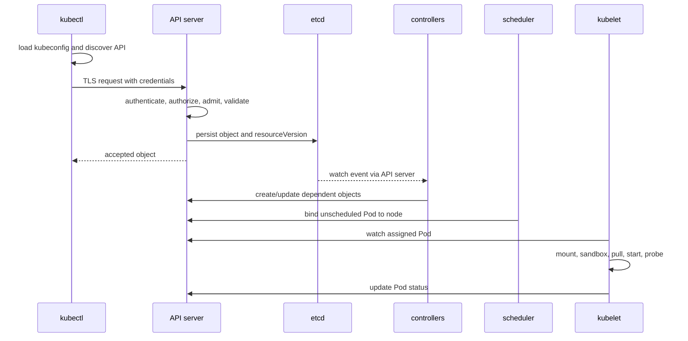

# Day 3 · How `kubectl` and API requests work

## Outcome

Trace `kubectl apply` from kubeconfig loading through API discovery, authentication, admission, storage, watch events, scheduling, and node execution.



## What `apply` actually means

`kubectl` selects a context, negotiates API groups, reads YAML, and sends a create or patch request. Server-side apply uses field ownership recorded in `managedFields`; conflicts occur when managers claim incompatible values. The API server's request pipeline is broadly authentication → authorization → mutating admission → schema/defaulting/validation → validating admission → persistence. Exact internal ordering has nuances, so reason about policy stages rather than memorizing one oversimplified list.

Success from `kubectl apply` means the desired object was accepted, not that a rollout is healthy. Controllers react asynchronously.

## Lab · Observe every boundary

```powershell
# Local serialization only; no server defaults or admission
kubectl create deployment flow-demo --image=nginx:1.27-alpine -n k8s-30d --dry-run=client -o yaml

# Ask the API server to validate/default without persisting
kubectl apply -f labs/manifests/01-web.yaml --server-side --dry-run=server -o yaml

# Persist and inspect field ownership and descendants
kubectl apply -f labs/manifests/01-web.yaml --server-side --field-manager=course
kubectl get deployment web -n k8s-30d -o yaml --show-managed-fields
kubectl get replicaset,pod -n k8s-30d -l app=web -o wide
kubectl rollout status deployment/web -n k8s-30d
kubectl get endpointslice -n k8s-30d -l kubernetes.io/service-name=web
```

Inspect raw discovery and API responses:

```powershell
kubectl get --raw /api
kubectl get --raw /apis/apps/v1
kubectl get --raw /apis/apps/v1/namespaces/k8s-30d/deployments/web
kubectl get events -n k8s-30d --watch
```

## Break/fix · Rejection versus reconciliation

Try an invalid image field and then a valid-but-unavailable image. The first should fail validation or object creation; the second is stored and fails asynchronously at kubelet.

```powershell
kubectl run invalid-spec -n k8s-30d --image='' --dry-run=server
kubectl run unavailable-image -n k8s-30d --image=invalid.example.invalid/nope:v1
kubectl get pod unavailable-image -n k8s-30d -o yaml
kubectl describe pod unavailable-image -n k8s-30d
kubectl delete pod unavailable-image -n k8s-30d
```

## Production issues

- **401 Unauthorized:** authentication failed—expired token/certificate, wrong credential plugin, or bad issuer.
- **403 Forbidden:** identity is known but RBAC or another authorizer denied the verb/resource.
- **429 Too Many Requests:** API priority/fairness or inflight limits are protecting the server; reduce abusive clients and watch cardinality.
- **admission timeout:** webhook is slow/unreachable; inspect failure policy, endpoints, TLS, and timeout.
- **apply conflict:** field ownership conflict; identify managers before forcing ownership.

## Interview practice

1. **What happens after `kubectl apply`?** Give the sequence in the diagram and distinguish acceptance from readiness.
2. **Client-side versus server-side dry-run?** Client dry-run performs local generation; server dry-run exercises server defaulting, validation, and admission without persistence.
3. **Why can apply succeed while a Pod fails?** API acceptance is synchronous, while scheduling, image pull, startup, and readiness are later reconciled transitions.
4. **How do watches scale better than polling?** Clients receive ordered changes after a resource version rather than repeatedly listing unchanged state; they must still relist on compaction or expiry.

