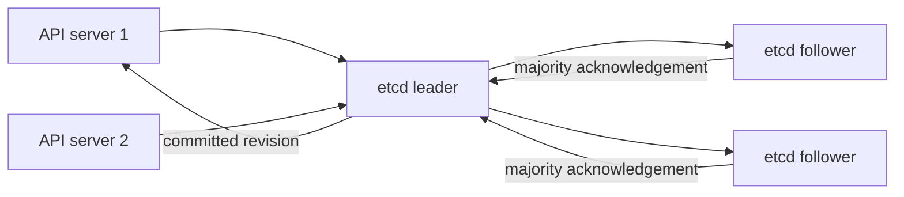

# Day 4 · etcd internals, backup, and failure

## Outcome

Explain why Kubernetes needs a strongly consistent store, how quorum affects availability, and how to reason about safe snapshot and restore.



etcd uses the Raft consensus algorithm. A write is committed only after a majority agrees. In a three-member cluster, quorum is two and one member can fail. In five, quorum is three and two can fail. Adding an even member does not increase failure tolerance but adds replication cost.

Kubernetes API objects are stored under an implementation-specific key prefix. Treat direct etcd access as a disaster-recovery/diagnostic operation, never as a supported way to edit Kubernetes objects. API `resourceVersion` supports optimistic concurrency and watch continuation; it should generally be treated as opaque.

## Lab · Observe versions through the API

```powershell
kubectl create configmap version-demo -n k8s-30d --from-literal=value=one
kubectl get configmap version-demo -n k8s-30d -o jsonpath='{.metadata.resourceVersion}{"`n"}'
kubectl patch configmap version-demo -n k8s-30d --type=merge -p '{"data":{"value":"two"}}'
kubectl get configmap version-demo -n k8s-30d -o jsonpath='{.metadata.resourceVersion}{"`n"}'
kubectl get configmap version-demo -n k8s-30d --watch --output-watch-events
```

In another terminal, patch the object again and observe an event. Stop the watch with Ctrl+C.

For kubeadm only, locate the etcd Pod and read its command before adapting snapshot commands:

```powershell
kubectl get pod -n kube-system -l component=etcd -o yaml
```

Conceptual snapshot workflow—paths, TLS files, endpoint, and tool location vary:

```text
ETCDCTL_API=3 etcdctl --endpoints=https://127.0.0.1:2379 \
  --cacert=<ca> --cert=<client-cert> --key=<client-key> \
  snapshot save snapshot.db
etcdutl snapshot status snapshot.db --write-out=table
etcdutl snapshot restore snapshot.db --data-dir=<new-empty-dir>
```

Never practice restore against your active cluster. Restore into a separate data directory and follow your distribution's documented procedure.

## Practical and production issues

| Signal | Likely cause | Safe response |
|---|---|---|
| high commit/apply latency | slow disk, contention, network latency | protect IOPS, examine fsync/network, reduce expensive API load |
| database quota exceeded | excessive objects/events or fragmentation | stop object churn, compact/defragment per runbook, increase quota cautiously |
| no leader | quorum/network/time instability | restore connectivity/member health; avoid random member removal |
| large watch/list load | high-cardinality objects or badly behaved clients | profile API clients, paginate lists, use shared informers |
| corrupt/lost quorum | disk failure or unsafe operations | declare incident, preserve data, restore verified snapshot using documented revision procedure |

Back up the etcd snapshot **and** the encryption configuration/keys and cluster PKI required to interpret it. Test restores, record snapshot revision and Kubernetes version, encrypt backups, and restrict access because snapshots contain Secrets unless encrypted at the API layer.

## Interview practice

1. **Why etcd?** It provides consistent, watchable, transactional cluster state with optimistic concurrency.
2. **What happens when one of three members fails?** Quorum remains; operate degraded, repair/replace carefully. A second failure loses write availability.
3. **Why not put application data in Kubernetes API objects?** The API and etcd are optimized for control state, not high-volume application workloads.
4. **etcd is full—what do you do?** Halt churn, confirm quota/size and alarms, take a snapshot, compact known revisions, defragment members safely one at a time, validate, and fix the producer.
5. **Why can defragmentation be risky?** It is resource-intensive and can block a member; sequence it while maintaining quorum and monitor latency.

