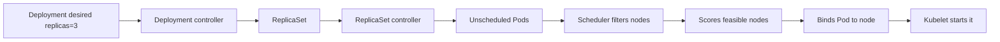

# Day 5 · Scheduler and controller manager

## Outcome

Separate reconciliation from placement and understand filter, score, bind, leader election, work queues, and idempotence.



Controllers usually list/watch objects, place keys on a rate-limited work queue, read the latest state, and perform idempotent reconciliation. A duplicate event must be harmless. Desired and observed state may converge only eventually.

The scheduler considers unscheduled Pods. It first filters infeasible nodes—resources, taints, affinity, volume constraints, ports—then scores feasible nodes using preferences and balancing plugins, reserves/permits if configured, and binds. Scheduling success does not imply the image, network, volume, or process will start.

## Lab · Watch the ownership chain

```powershell
kubectl apply -f labs/manifests/01-web.yaml
kubectl get deployment,replicaset,pod -n k8s-30d -l app=web --show-labels
kubectl get deployment web -n k8s-30d -o jsonpath='{.metadata.uid}{"`n"}'
kubectl get replicaset -n k8s-30d -l app=web -o jsonpath='{range .items[*]}{.metadata.name}{" owner="}{.metadata.ownerReferences[0].kind}{"/"}{.metadata.ownerReferences[0].name}{"`n"}{end}'
kubectl get pod -n k8s-30d -l app=web -o custom-columns=NAME:.metadata.name,NODE:.spec.nodeName,OWNER:.metadata.ownerReferences[0].kind,READY:.status.conditions[-1].status
```

Scale and watch reconciliation:

```powershell
kubectl get pod -n k8s-30d -l app=web --watch
# In another terminal:
kubectl scale deployment/web -n k8s-30d --replicas=5
kubectl scale deployment/web -n k8s-30d --replicas=3
```

## Break/fix · Unschedulable resource request

```powershell
kubectl run too-large -n k8s-30d --image=nginx:1.27-alpine --requests='cpu=100000,memory=1Ti'
kubectl describe pod too-large -n k8s-30d
kubectl get events -n k8s-30d --field-selector reason=FailedScheduling
kubectl delete pod too-large -n k8s-30d
```

If your `kubectl run` version does not support `--requests`, generate YAML with `--dry-run=client -o yaml`, add resources, and apply it.

## Production issues

- **Scheduler leader exists but Pods remain Pending:** examine `FailedScheduling`, queue/scheduling duration metrics, extender/plugin latency, API connectivity, and constraints.
- **Controllers lag:** compare work-queue depth/retries, API throttling, reconcile errors, and object churn.
- **Multiple controller replicas:** only the elected leader actively runs singleton loops; Leases reveal renewals. A slow failover can delay healing.
- **Hot reconciliation loop:** a controller repeatedly writes a value another actor reverts. Audit managed fields/events and remove competing ownership.

## Interview practice

1. **How does the scheduler select a node?** Requirements enter filters; feasible nodes enter scoring; extensions may reserve/permit; binding writes the decision.
2. **Does the scheduler start containers?** No. It records node assignment. The node's kubelet drives runtime, network, mounts, and probes.
3. **What makes a good controller?** Level-triggered, idempotent reconciliation; bounded retries; current-state reads; status/conditions; correct ownership/finalization.
4. **What if no node matches?** The Pod remains Pending and is retried when relevant cluster state changes; events explain the current blockers.

