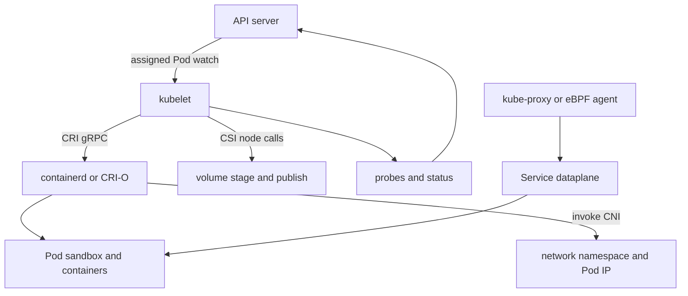

# Day 6 · Worker node internals

## Outcome

Trace an assigned Pod through kubelet, CRI/containerd, image pulls, CNI, CSI, probes, status, and the Service dataplane.



The kubelet owns the local realization loop for Pods assigned to its node. Through the Container Runtime Interface it creates a Pod sandbox, pulls images, creates and starts containers. The runtime invokes configured CNI plugins for sandbox networking; kubelet coordinates volume mounting through in-tree logic or CSI node plugins. Kubelet executes probes and reports Pod/node status.

`kube-proxy` is separate. It watches Services and EndpointSlices and programs node forwarding rules in iptables, IPVS, or an implementation-specific dataplane. Some eBPF CNIs replace kube-proxy.

## Lab · Correlate API and node facts

```console
helm upgrade k8s-30d labs/kubernetes-internals --namespace default --reuse-values --set labs.web.enabled=true
kubectl get nodes -o wide
kubectl describe node
kubectl get pods -n k8s-30d -o custom-columns=NAME:.metadata.name,NODE:.spec.nodeName,POD_IP:.status.podIP,HOST_IP:.status.hostIP,CONTAINER_ID:.status.containerStatuses[0].containerID
kubectl get node -o jsonpath='{range .items[*]}{.metadata.name}{" runtime="}{.status.nodeInfo.containerRuntimeVersion}{" kubelet="}{.status.nodeInfo.kubeletVersion}{"\n"}{end}'
kubectl get daemonset -n kube-system
```

Use an ephemeral node debugger only on the disposable cluster:

```console
kubectl get nodes
kubectl debug node/<node-name> -it --image=ubuntu --profile=sysadmin
```

Replace `<node-name>` with a node from the first command. Inside, host files are commonly mounted under `/host`. Depending on distribution, inspect `crictl ps`, network interfaces, mounts, and logs. Exit without changing host state.

## Practical issue · Node NotReady

Run this evidence chain:

```console
kubectl get node -o wide
kubectl describe node <node-name>
kubectl get lease -n kube-node-lease <node-name> -o yaml
kubectl get events -A --field-selector involvedObject.kind=Node
kubectl get pods -A --field-selector spec.nodeName=<node-name>
```

Distinguish:

- `Ready=Unknown`: control plane stopped receiving kubelet heartbeats; investigate kubelet, node/network, certs, API path.
- `Ready=False`: kubelet is reporting an explicit unhealthy state.
- `DiskPressure`, `MemoryPressure`, `PIDPressure`: eviction manager may act even if the application seems healthy.
- `NetworkUnavailable`: CNI initialization or route programming problem.

## Production issues

| Symptom | Likely stage | Evidence |
|---|---|---|
| `ContainerCreating` + sandbox error | runtime/CNI | Pod events, runtime and CNI logs |
| `ErrImagePull` | registry/auth/DNS | event message, image reference, pull secret |
| mount timeout | CSI/kubelet/storage | Pod events, VolumeAttachment, CSI logs |
| frequent probe restarts | app/probe/node pressure | current and previous logs, probe result, node pressure |
| node heartbeat stale | kubelet/API/network | Lease renew time, service logs, TCP/TLS path |

## Interview practice

1. **How does kubelet communicate with the API server?** It authenticates as a node, watches Pods assigned to it, and posts node/Pod status through the API; authorization limits node access.
2. **What is CRI?** A gRPC contract that decouples kubelet from container runtime implementations.
3. **Who assigns the Pod IP?** The configured CNI plugin during sandbox network setup; exact IPAM and routing are implementation-specific.
4. **What happens if kubelet stops?** Existing containers may keep running under the runtime, but probes/status/reconciliation stop; the node becomes NotReady and workloads may eventually be replaced elsewhere.
