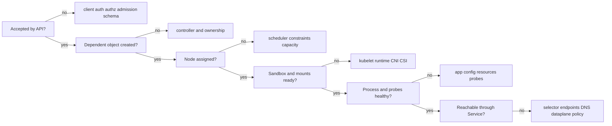

# Day 7 · Architecture failure game

## Outcome

Integrate Days 1-6 under time pressure. You will diagnose a failure by locating the last successful transition instead of guessing.



## Lab · Three blind incidents

Ask a colleague to choose one scenario, or choose randomly and hide the title. Set a 12-minute timer per scenario.

### Scenario A · Accepted but never scheduled

```powershell
kubectl apply -f labs/manifests/09-failures.yaml
kubectl get pods -n k8s-30d
```

Diagnose `failure-pending`. Do not read the manifest until you have collected status, node assignment, conditions, and events. Repair by labeling a disposable node or removing the selector. Prefer patching the Pod's controller in real systems; this standalone Pod must be recreated because most Pod spec fields are immutable.

### Scenario B · Controller chain

```powershell
kubectl apply -f labs/manifests/01-web.yaml
kubectl scale deployment/web -n k8s-30d --replicas=4
kubectl get deployment,replicaset,pod -n k8s-30d -l app=web
```

Explain every owner relationship and status count. Delete one Pod and prove which controller restores it. Then scale to zero and prove why no restoration occurs.

### Scenario C · API-to-Service trace

```powershell
kubectl apply -f labs/manifests/01-web.yaml
kubectl run client -n k8s-30d --image=busybox:1.36.1 --restart=Never -- sleep 1d
kubectl exec -n k8s-30d client -- wget -qO- http://web
```

Patch the Service selector to `app=wrong`, observe EndpointSlices, diagnose, and restore:

```powershell
kubectl patch service web -n k8s-30d --type=merge -p '{"spec":{"selector":{"app":"wrong"}}}'
kubectl get service,endpointslice -n k8s-30d
kubectl exec -n k8s-30d client -- wget -T 2 -qO- http://web
kubectl patch service web -n k8s-30d --type=merge -p '{"spec":{"selector":{"app":"web"}}}'
```

## Incident note template

Write five lines for each scenario:

1. **Impact:** what user-visible behavior failed?
2. **Scope:** one Pod, workload, node, namespace, or cluster?
3. **Evidence:** exact condition/event/log/metric that disproved alternatives.
4. **Mitigation:** smallest reversible action that restored service.
5. **Prevention:** alert, validation, capacity, test, or runbook improvement.

## Production architecture questions

- API slow but healthy: inspect request latency by verb/resource, inflight/APF queues, admission webhooks, etcd request duration, client list/watch behavior, and control-plane resource saturation.
- Scheduler healthy but backlog grows: quantify unschedulable reasons; separate true capacity from mutually impossible constraints.
- Nodes keep workloads while control plane fails: protect users, avoid unnecessary restarts, restore quorum/API, then assess stale configuration and queued reconciliation.
- Controller storm after recovery: monitor API/etcd load and work queues; restore gradually if your platform supports safe throttling.

## Interview checkpoint

Answer each in under three minutes:

1. What happens when `kubectl apply` creates a Deployment?
2. Can Pods run when the control plane is unavailable?
3. What is the difference between a controller and the scheduler?
4. How do you diagnose a Pod that never receives a node name?
5. What is the failure tolerance of three- and five-member etcd clusters?

Strong answers follow: **mechanism → failure effect → evidence → mitigation → prevention**. Avoid reciting component names without describing their interactions.

