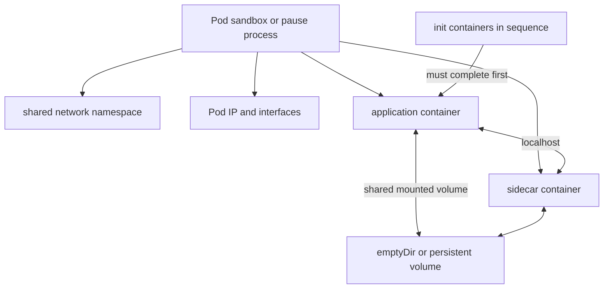

# Day 8 · Pod internals

## Outcome

Explain the Pod as a shared isolation envelope: lifecycle, sandbox/pause container, namespaces, init and sidecar patterns, volumes, restart policy, and termination.



## Internals

The runtime creates a Pod sandbox, commonly represented by an infrastructure or “pause” container. Its long-lived process holds shared Linux namespaces, especially the network namespace, so application containers can restart without destroying the Pod network identity. Runtime and CNI implementation details vary, but the stable contract is one Pod IP and shared network namespace.

Containers in a Pod:

- share network interfaces, IP, port space, and `localhost`;
- can share IPC and optionally a process namespace;
- have separate root filesystems and usually separate PID namespaces by default;
- share data only through explicitly mounted volumes;
- are co-scheduled and share the Pod lifecycle, not independent placement.

Init containers run to completion in order before normal application containers. Sidecars run alongside the application; modern Kubernetes also supports sidecar semantics for restartable init containers, but confirm feature/version behavior before relying on it. `emptyDir` survives container restarts but disappears when the Pod is removed.

Pod phase (`Pending`, `Running`, `Succeeded`, `Failed`, `Unknown`) is coarse. Container states (`Waiting`, `Running`, `Terminated`), reasons, exit codes, restart counts, and Pod conditions are better diagnostic evidence.

## Lab · Init, sidecar, namespaces, volume

```console
helm upgrade k8s-30d labs/kubernetes-internals --namespace default --reuse-values --set labs.podInternals.enabled=true
kubectl get pod pod-internals -n k8s-30d -w
kubectl describe pod pod-internals -n k8s-30d
kubectl logs pod-internals -n k8s-30d -c initialize
kubectl logs pod-internals -n k8s-30d -c log-sidecar --tail=10
kubectl exec pod-internals -n k8s-30d -c application -- cat /work/status
kubectl exec pod-internals -n k8s-30d -c application -- hostname -i
kubectl exec pod-internals -n k8s-30d -c log-sidecar -- hostname -i
```

Restart only the application process and verify `emptyDir` remains:

```console
kubectl exec pod-internals -n k8s-30d -c application -- sh -c 'kill 1'
kubectl get pod pod-internals -n k8s-30d
kubectl logs pod-internals -n k8s-30d -c application --previous
kubectl exec pod-internals -n k8s-30d -c log-sidecar -- tail /work/app.log
```

If PID 1 does not terminate under the runtime, delete the container process through a deliberately failing command in a copied debug Pod instead. The learning goal is container restart versus Pod replacement.

## Practical and production issues

- **Init container loops:** application containers never start. Inspect `status.initContainerStatuses`, init logs, mounts, DNS, and dependencies.
- **Sidecar not ready:** one failing readiness probe makes the whole Pod unready; determine whether sidecar readiness truly belongs in traffic eligibility.
- **Port collision:** containers share a network namespace, so two cannot bind the same IP/port.
- **Restart policy confusion:** Deployment Pods use `Always`; kubelet restarts failed containers with backoff, while a controller replaces deleted/terminal Pods.
- **Zombie processes:** PID 1 must reap children; use a proper init or application process behavior.

## Interview practice

1. **Why use a pause container?** It provides a stable sandbox/namespace anchor so workload containers share Pod networking and can restart independently.
2. **Can two containers communicate over localhost?** Yes, because they share the Pod network namespace; they must use distinct listening ports.
3. **Pod versus container?** A Pod is the scheduled API/lifecycle and shared-resource unit containing one or more containers.
4. **Why are Pods ephemeral?** Controllers treat instances as replaceable; identity and durable data belong in higher-level workload/storage abstractions.
5. **Init versus sidecar?** Init containers gate startup and normally complete; sidecars provide ongoing supporting behavior alongside the app.
