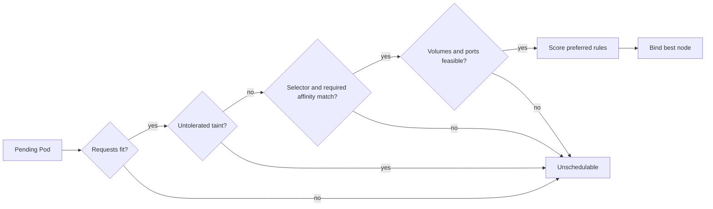

# Day 9 · Scheduling controls

## Outcome

Use resource requests, node labels/selectors, taints/tolerations, and node affinity deliberately—and debug an unschedulable Pod from its event message.



## Core concepts

The scheduler reserves against **requests**, not live utilization and not limits. A node can look idle in `kubectl top` yet be unavailable because requested capacity is exhausted. Conversely, under-requested workloads can be packed too tightly and overload a node.

- `nodeSelector` is exact label matching.
- Required node affinity is expressive hard placement: operators such as `In`, `NotIn`, `Exists`, and multiple terms.
- Preferred node affinity affects scoring but does not block placement.
- A **taint** repels Pods; a **toleration** allows consideration but does not attract or guarantee placement.
- `NoSchedule` blocks new placement, `PreferNoSchedule` is soft, and `NoExecute` can also evict existing Pods without a matching toleration.

Use stable, controlled node labels—not cloud-generated names that may change. Security-sensitive isolation may require protected node labels and admission controls, not user-writable labels.

## Lab · Label, taint, tolerate

Use only a disposable local node:

```console
kubectl get nodes
kubectl label node <node-name> course.example.com/disk=fast
kubectl get node <node-name> --show-labels
kubectl run selected -n k8s-30d --image=busybox:1.36.1 --overrides='{"spec":{"nodeSelector":{"course.example.com/disk":"fast"},"containers":[{"name":"selected","image":"busybox:1.36.1","command":["sleep","1d"]}]}}'
kubectl get pod selected -n k8s-30d -o wide
```

Taint the node and prove a non-tolerating Pod remains Pending:

```console
kubectl taint node <node-name> dedicated=course:NoSchedule
kubectl run not-tolerating -n k8s-30d --image=busybox:1.36.1 -- sleep 1d
kubectl describe pod not-tolerating -n k8s-30d
```

Apply a tolerating Pod:

```console
kubectl run tolerating -n k8s-30d --image=busybox:1.36.1 --overrides='{"spec":{"tolerations":[{"key":"dedicated","operator":"Equal","value":"course","effect":"NoSchedule"}],"containers":[{"name":"tolerating","image":"busybox:1.36.1","command":["sleep","1d"]}]}}'
kubectl get pods -n k8s-30d -o wide
```

Clean up immediately:

```console
kubectl taint node <node-name> dedicated=course:NoSchedule-
kubectl label node <node-name> course.example.com/disk-
kubectl delete pod selected not-tolerating tolerating -n k8s-30d --ignore-not-found
```

## Production issues

| Event fragment | Interpretation | Fix direction |
|---|---|---|
| `Insufficient cpu` | requests do not fit | right-size, add capacity, or reschedule lower-value work |
| `untolerated taint` | node pool repels Pod | verify intended pool; add precise toleration only if justified |
| `didn't match node affinity` | hard label rule impossible | fix labels/rules; check multiple term logic |
| `unbound immediate PersistentVolumeClaims` | storage blocks placement | inspect PVC, StorageClass, topology, provisioner |
| `didn't have free ports` | requested host port conflicts | remove hostPort or distribute Pods |

## Interview practice

1. **NodeSelector versus node affinity?** Both constrain labels; affinity adds expressive hard and soft rules.
2. **Taint versus toleration?** Taint repels; toleration removes that rejection. Affinity may still be needed to attract.
3. **Why Pending when CPU looks free?** Scheduling uses requested allocatable capacity and other feasibility constraints, not current CPU percentage.
4. **What does NoExecute do?** It prevents scheduling and can evict already running Pods lacking a matching toleration, optionally after `tolerationSeconds`.
