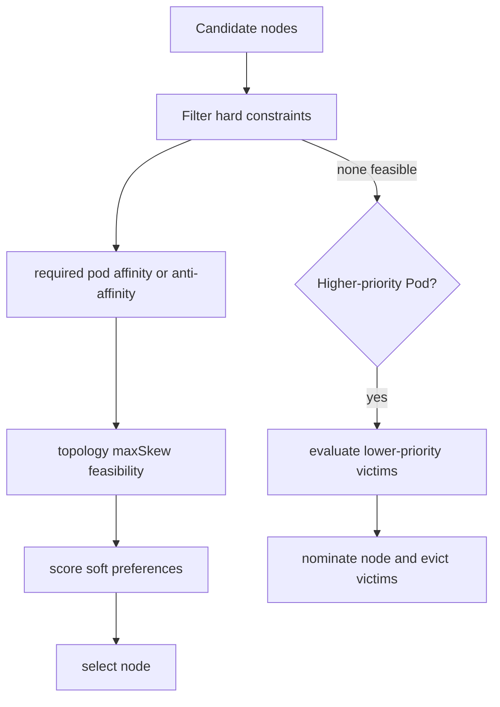

# Day 10 · Affinity, topology spread, priority, and preemption

## Outcome

Design resilient placement without creating impossible constraints, and explain how priority and preemption interact with disruption.



Pod affinity places a Pod near selected Pods; anti-affinity separates it. The `topologyKey` defines “near” or “apart”—node hostname, zone, region, or another consistent label. Required anti-affinity can make rollouts unschedulable when replicas exceed topology domains.

Topology spread constraints express balanced distribution with `maxSkew`, a topology key, label selector, and hard (`DoNotSchedule`) or soft (`ScheduleAnyway`) behavior. Unlike pairwise anti-affinity, spread directly models count imbalance.

PriorityClass influences scheduling order. If a high-priority Pod cannot fit, preemption may evict lower-priority Pods to make room. Preemption is not instant scheduling: victims terminate, volumes detach, and constraints may change. PDBs are considered where possible but do not provide an absolute guarantee against all preemption outcomes.

## Lab · Observe placement

```console
helm upgrade k8s-30d labs/kubernetes-internals --namespace default --reuse-values --set labs.scheduling.enabled=true
kubectl get priorityclass k8s-30d-important
kubectl get pod -n k8s-30d -l app=placement-demo -o custom-columns=NAME:.metadata.name,NODE:.spec.nodeName,PRIORITY:.spec.priority,PHASE:.status.phase
kubectl get deployment placement-demo -n k8s-30d -o yaml
kubectl describe pod -n k8s-30d -l app=placement-demo
```

Scale beyond the number of nodes. Because the rules are preferences and `ScheduleAnyway`, Pods should still schedule:

```console
kubectl scale deployment/placement-demo -n k8s-30d --replicas=8
kubectl get pod -n k8s-30d -l app=placement-demo -o wide
```

Now edit the Deployment and change anti-affinity from preferred to required or spread behavior to `DoNotSchedule`. Predict the Pending count before saving, then inspect scheduler events. Revert with:

```console
helm upgrade k8s-30d labs/kubernetes-internals --namespace default --reuse-values --set labs.scheduling.enabled=true
```

Clean the cluster-scoped PriorityClass after the day:

```console
helm upgrade k8s-30d labs/kubernetes-internals --namespace default --reuse-values --set labs.scheduling.enabled=false
```

## Practical design exercises

- **Three API replicas across zones:** hard spread across hostname, usually soft or hard spread across zones depending on capacity and failure policy.
- **Cache near application:** pod affinity may reduce latency but couples scheduling; use preferred rules when availability matters more.
- **Dedicated security node pool:** taint/toleration plus node affinity; protect node label mutation.
- **Critical platform Pods:** use a carefully scoped high priority, guaranteed requests, and capacity reservation—not priority everywhere.

## Production issues

- `maxSkew` is calculated among eligible topology domains; missing/inconsistent labels create surprising behavior.
- Required inter-Pod affinity can be expensive at scale and can deadlock first-Pod placement unless designed carefully.
- Overusing high priority turns normal resource pressure into unpredictable evictions.
- Preemption loops indicate systemic capacity or impossible constraints; inspect nominated nodes, victim termination, PDBs, and scheduler events.

## Interview practice

1. **Pod affinity versus topology spread?** Affinity models relation to selected Pods; spread models replica-count skew across domains.
2. **What is preemption?** Scheduler-directed eviction of lower-priority Pods to create feasible capacity for an unschedulable higher-priority Pod.
3. **Can PDB stop every eviction?** No. It governs voluntary disruptions through the eviction API and is not a universal shield against failures, direct deletes, or all preemption necessities.
4. **How would you spread replicas across zones?** Label domains consistently, define topology spread/anti-affinity, decide hard versus soft behavior, and preserve spare capacity.
