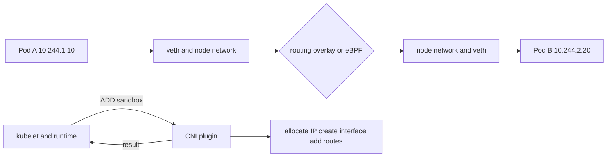

# Day 11 · Kubernetes network model and CNI

## Outcome

Explain Pod IP allocation, network namespaces, cross-node routing, CNI execution, and why the implementation differs across Calico, Cilium, Flannel, cloud CNIs, and local clusters.



The base Kubernetes network model expects each Pod to have a cluster-reachable IP, Pods to communicate without application-level NAT, and nodes/agents to reach Pods. How this is implemented is delegated to the network provider.

CNI is an executable/plugin specification used by runtimes to add and remove a container network attachment. A plugin may call IPAM, create a veth pair, connect bridges, program routes, establish VXLAN/Geneve overlays, attach cloud interfaces, or install eBPF programs. Kubernetes itself does not mandate one method.

Pod IPs are ephemeral. Applications discover stable backends through Services/DNS and must not persist Pod IP assumptions. `hostNetwork` bypasses normal Pod isolation/IP allocation and creates host port/security concerns.

## Lab · Trace Pod-to-Pod

```powershell
kubectl apply -f labs/manifests/01-web.yaml
kubectl run netshoot -n k8s-30d --image=nicolaka/netshoot --restart=Never -- sleep 1d
kubectl get pod -n k8s-30d -o custom-columns=NAME:.metadata.name,NODE:.spec.nodeName,IP:.status.podIP
$target = kubectl get pod -n k8s-30d -l app=web -o jsonpath='{.items[0].status.podIP}'
kubectl exec -n k8s-30d netshoot -- ip addr
kubectl exec -n k8s-30d netshoot -- ip route
kubectl exec -n k8s-30d netshoot -- curl -sS --connect-timeout 2 http://$target
kubectl exec -n k8s-30d netshoot -- tracepath $target
```

Inspect the installed CNI and node agent:

```powershell
kubectl get daemonset -A
kubectl get pods -n kube-system -o wide
kubectl get node -o jsonpath='{range .items[*]}{.metadata.name}{" podCIDR="}{.spec.podCIDR}{"`n"}{end}'
```

On a disposable node debug shell, compare host interfaces/routes with the Pod view. Names and commands depend on the CNI; document what you actually observe rather than forcing the generic diagram onto it.

## Break/fix reasoning

A Pod stuck in `ContainerCreating` with `FailedCreatePodSandBox` has not reached application startup. Check:

```powershell
kubectl describe pod <pod> -n k8s-30d
kubectl get pods -n kube-system -o wide
kubectl logs -n kube-system <cni-node-pod> --all-containers --tail=200
kubectl describe node <node>
```

Common causes: exhausted IP pool, missing CNI config/binary, agent not ready, MTU mismatch, broken node routes, cloud security policy, or stale endpoint state.

## Production issues

- **Only large packets fail:** suspect MTU/encapsulation and path-MTU discovery, not DNS.
- **Same-node works, cross-node fails:** inspect node routes, tunnel peers, security groups/firewall, and CNI health.
- **New Pods fail, existing Pods work:** IPAM exhaustion or CNI control-plane degradation.
- **Intermittent conntrack drops:** inspect node conntrack usage and Service traffic patterns.
- **Source IP unexpected:** understand Service external traffic policy, SNAT/masquerade, ingress proxying, and CNI implementation.

## Interview practice

1. **Why does every Pod have its own IP?** It creates a flat addressable endpoint model and avoids per-container host-port allocation; the CNI implements it.
2. **How does cross-node communication happen?** Through CNI-programmed routes, overlays, cloud networking, or eBPF datapaths; explain one implementation and state that it varies.
3. **What is CNI?** The runtime-facing plugin contract for adding/removing network attachments, not itself a single networking product.
4. **Why not depend on Pod IPs?** Pod instances and IPs are replaceable; use Services, headless discovery, or controller-managed identity.

