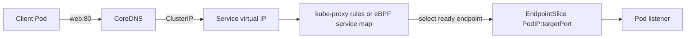

# Day 12 · Services, EndpointSlices, kube-proxy, iptables, IPVS, eBPF

## Outcome

Trace a packet from a client to a Service backend and diagnose each mapping: DNS name → ClusterIP → port → EndpointSlice → ready Pod.



A Service is an API abstraction with a virtual IP and port mapping. Controllers derive EndpointSlices from selector-matching, ready Pods. The dataplane watches both resources and programs forwarding.

- **ClusterIP:** internal stable virtual IP.
- **NodePort:** reserves a port on nodes and forwards to the Service.
- **LoadBalancer:** asks an integration/controller for an external load balancer, usually building on the Service model.
- **ExternalName:** DNS CNAME-like alias; no proxying.
- **Headless (`clusterIP: None`):** DNS returns endpoint addresses instead of a virtual IP.

In iptables mode, rules probabilistically DNAT traffic to endpoints. IPVS uses kernel virtual-server tables and multiple scheduling algorithms but still relies on surrounding rules. eBPF implementations may replace both with maps/programs. Read the cluster's actual configuration before explaining its dataplane.

## Lab · Walk the chain

```console
helm upgrade k8s-30d labs/kubernetes-internals --namespace default --reuse-values --set labs.web.enabled=true
kubectl run client -n k8s-30d --image=nicolaka/netshoot --restart=Never -- sleep 1d
kubectl get service web -n k8s-30d -o wide
kubectl get endpointslice -n k8s-30d -l kubernetes.io/service-name=web -o wide
kubectl get pod -n k8s-30d -l app=web -o wide
kubectl exec -n k8s-30d client -- curl -sS http://web
kubectl get service web -n k8s-30d -o custom-columns=NAME:.metadata.name,CLUSTER-IP:.spec.clusterIP
kubectl exec -n k8s-30d client -- curl -sS http://<cluster-ip>
```

Replace `<cluster-ip>` with the printed ClusterIP. Compare Service `port`, named `targetPort`, Pod container port, actual listener, selectors, and EndpointSlice readiness.

Determine the implementation:

```console
kubectl get daemonset -n kube-system
kubectl get configmap kube-proxy -n kube-system -o yaml
kubectl logs -n kube-system -l k8s-app=kube-proxy --tail=100
```

Clusters with kube-proxy replacement may have no kube-proxy DaemonSet; inspect the CNI agent configuration instead.

## Break/fix · Empty endpoints

```console
kubectl patch service web -n k8s-30d --type=merge -p '{"spec":{"selector":{"app":"typo"}}}'
kubectl get endpointslice -n k8s-30d -l kubernetes.io/service-name=web
kubectl exec -n k8s-30d client -- curl --connect-timeout 2 http://web
kubectl patch service web -n k8s-30d --type=merge -p '{"spec":{"selector":{"app":"web"}}}'
kubectl rollout status deployment/web -n k8s-30d
```

## Production troubleshooting order

1. Resolve the Service name from the client Pod.
2. Inspect Service IP, ports, selector, and IP family.
3. Inspect EndpointSlices and their `ready`, `serving`, and `terminating` conditions.
4. Curl a Pod IP/target port from the same client.
5. Curl the ClusterIP/Service port.
6. Inspect network policy, kube-proxy/eBPF state, conntrack, and node path.

This order prevents a week of iptables debugging when the selector is misspelled.

## Interview practice

1. **What happens when a Pod accesses a Service?** DNS may resolve the name; the virtual IP/port hits node dataplane rules; one ready EndpointSlice address is selected and forwarded.
2. **iptables versus IPVS?** They use different kernel mechanisms and lookup models; both are kube-proxy implementations. Discuss operational behavior, not a simplistic performance slogan.
3. **What does kube-proxy do?** Watches Service/EndpointSlice state and realizes the Service forwarding dataplane; it is not an HTTP proxy.
4. **Service exists but is unreachable—first check?** EndpointSlices, selector, ports, and direct backend reachability before low-level dataplane inspection.
