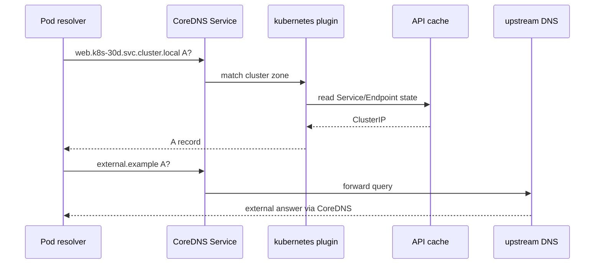

# Day 13 · DNS and CoreDNS

## Outcome

Understand Kubernetes DNS records, Pod resolver configuration, CoreDNS flow, search domains, `ndots`, caching, and production failure patterns.



Typical Service FQDN is `<service>.<namespace>.svc.<cluster-domain>`. Search domains let a Pod use short names, but namespace matters. A headless Service returns endpoint records rather than a ClusterIP. StatefulSet/headless combinations provide stable per-Pod names when correctly configured.

The kubelet writes Pod resolver configuration according to `dnsPolicy` and `dnsConfig`. With `ClusterFirst`, the nameserver is normally the cluster DNS Service. Search expansion plus a high `ndots` value can turn dotted external names into several attempted cluster queries before the absolute query, amplifying latency and load. Add a trailing dot to test an absolute FQDN.

## Lab · Query and observe

```powershell
kubectl apply -f labs/manifests/01-web.yaml
kubectl run dns-client -n k8s-30d --image=registry.k8s.io/e2e-test-images/dnsutils:1.3 --restart=Never -- sleep 1d
kubectl exec -n k8s-30d dns-client -- cat /etc/resolv.conf
kubectl exec -n k8s-30d dns-client -- nslookup web
kubectl exec -n k8s-30d dns-client -- nslookup web.k8s-30d.svc.cluster.local
kubectl exec -n k8s-30d dns-client -- nslookup kubernetes.default.svc.cluster.local
kubectl get service,endpointslice -n kube-system -l k8s-app=kube-dns
kubectl get pods -n kube-system -l k8s-app=kube-dns -o wide
kubectl logs -n kube-system -l k8s-app=kube-dns --tail=100
```

Test namespace search behavior:

```powershell
kubectl run other-client -n default --image=registry.k8s.io/e2e-test-images/dnsutils:1.3 --restart=Never -- sleep 1d
kubectl exec -n default other-client -- nslookup web
kubectl exec -n default other-client -- nslookup web.k8s-30d
kubectl exec -n default other-client -- nslookup web.k8s-30d.svc.cluster.local
kubectl delete pod other-client -n default
```

## Break/fix model

If `web` fails but the FQDN works, the issue is search scope/configuration. If both fail but direct CoreDNS Service IP queries work, inspect resolver config. If CoreDNS answers cluster names but not external names, inspect the forwarder/upstream. If only a Service name fails, inspect that Service/EndpointSlice and CoreDNS API watch permissions/state.

```powershell
$dnsIp = kubectl get service kube-dns -n kube-system -o jsonpath='{.spec.clusterIP}'
kubectl exec -n k8s-30d dns-client -- nslookup web.k8s-30d.svc.cluster.local $dnsIp
kubectl exec -n k8s-30d dns-client -- nslookup example.com $dnsIp
```

## Production issues

- CoreDNS replicas are CPU-throttled or unevenly distributed: queries time out during bursts.
- Upstream resolver is unreachable: cluster names work, external names fail.
- Bad `resolv.conf` or stub loop: CoreDNS forwards to itself and logs loop/failure symptoms.
- NetworkPolicy blocks UDP/TCP 53: confirm both protocols where needed.
- Negative caching and stale assumptions: retest authoritative state and cache TTL behavior.
- Excess search expansion: measure query rate/latency and use FQDNs or tune application/resolver design carefully.

## Interview practice

1. **How does DNS work in Kubernetes?** Pods query a cluster DNS Service; CoreDNS watches API objects for the cluster zone and forwards other zones upstream.
2. **Why can short names fail across namespaces?** Search paths prioritize the caller's namespace; use `service.namespace` or the FQDN.
3. **Why does `curl service` fail while Pod IP works?** Check DNS first, then Service/Endpoint mapping; direct IP success narrows away application listener/network path.
4. **What is `ndots`?** A resolver threshold controlling whether a name is tried through search domains before as an absolute name; it can multiply queries.

