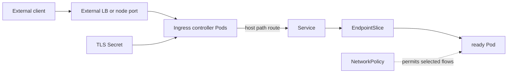

# Day 14 · Ingress, TLS, and NetworkPolicy

## Outcome

Distinguish Ingress API objects from controllers and load balancers, trace TLS termination and HTTP routing, and enforce traffic intent with NetworkPolicy.



An Ingress resource is configuration. An Ingress controller watches it and configures a proxy/load balancer. Creating Ingress without a compatible controller does nothing. `IngressClass` selects implementation behavior. Gateway API is a newer, more expressive family, but Ingress remains widespread.

TLS is commonly terminated at the controller using a Secret referenced by the route. Decide whether the backend is plain HTTP, re-encrypted TLS, or pass-through; annotations are controller-specific. A `502` usually means the proxy cannot get a valid backend response, whereas a default `404` often means no host/path rule matched.

NetworkPolicy is allow-list intent enforced by a supporting CNI. Policies are additive. Once a Pod is selected for ingress or egress isolation, only unioned allowed traffic passes for that direction. The API accepting a policy does not prove the CNI enforces it.

## Lab A · Ingress

Enable your local distribution's ingress controller first, then discover the class:

```powershell
kubectl apply -f labs/manifests/01-web.yaml
kubectl get ingressclass
kubectl create ingress course -n k8s-30d --class=nginx --rule='course.local/*=web:80'
kubectl get ingress course -n k8s-30d -o yaml
kubectl describe ingress course -n k8s-30d
```

Replace `nginx` with the installed class. Map `course.local` to the controller address only in your local environment, then test while preserving the Host header:

```powershell
curl.exe -H "Host: course.local" http://<ingress-address>/
kubectl logs -n <controller-namespace> <controller-pod> --tail=100
```

For TLS, generate a local certificate with a tool you trust, create a Secret, and add it to the Ingress:

```powershell
kubectl create secret tls course-tls -n k8s-30d --cert=course.crt --key=course.key
kubectl patch ingress course -n k8s-30d --type=merge -p '{"spec":{"tls":[{"hosts":["course.local"],"secretName":"course-tls"}]}}'
```

Do not commit private keys.

## Lab B · Default deny and explicit allow

```powershell
kubectl run denied -n k8s-30d --image=nicolaka/netshoot --restart=Never -- sleep 1d
kubectl run allowed -n k8s-30d --labels='access=web' --image=nicolaka/netshoot --restart=Never -- sleep 1d
kubectl apply -f labs/manifests/07-security.yaml
kubectl exec -n k8s-30d denied -- curl --connect-timeout 2 http://web
kubectl exec -n k8s-30d allowed -- curl --connect-timeout 2 http://web
```

Expected on a policy-enforcing CNI: denied times out, allowed succeeds. If both succeed, inspect CNI policy support before blaming YAML. Delete the security manifest after testing so later labs are not silently isolated.

## Production troubleshooting

| Symptom | First checks |
|---|---|
| default backend 404 | Host/path/class and loaded controller config |
| 502/503 | Service port, EndpointSlice readiness, backend protocol, controller-to-Pod policy |
| TLS certificate mismatch | SNI/host, Secret namespace/name, certificate SAN/chain, controller reload |
| external timeout | LB health, firewall/security group, NodePort/controller readiness |
| policy unexpectedly blocks | source/destination selectors, namespaces, ports, ingress plus egress, DNS allowance |

## Interview practice

1. **Ingress versus Service LoadBalancer?** LoadBalancer exposes one Service at L4; Ingress provides controller-implemented HTTP(S) routing across Services.
2. **Why does an Ingress return 502?** The controller matched the route but failed to communicate successfully with a backend; follow Service, EndpointSlice, port/protocol, readiness, and policy.
3. **Why NetworkPolicy?** It limits east-west/north-south reachability based on workload identity, reducing blast radius; it requires an enforcing CNI.
4. **Are policies ordered?** No. Applicable policies are additive allow rules; there is no first-match rule order in the API model.

