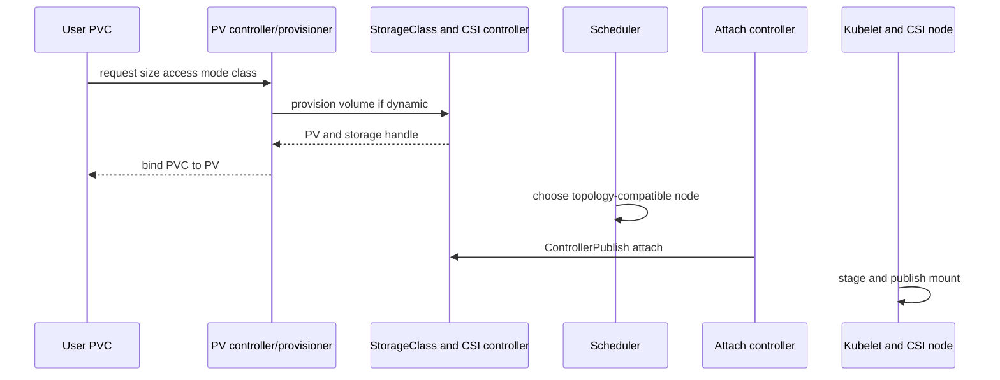

# Day 15 · Persistent storage, StorageClass, and CSI

## Outcome

Trace a claim from PVC through provisioning, scheduling topology, attach, mount, and Pod use; diagnose Pending claims and mount failures.



## Model

- A **PV** represents cluster storage capacity and lifecycle metadata.
- A **PVC** is a namespaced request for capacity, access mode, volume mode, and class.
- A **StorageClass** describes a provisioner and policy such as reclaim behavior, binding mode, expansion, and parameters.
- **CSI** standardizes storage controller/node operations so vendors can ship out-of-tree drivers.

Dynamic provisioning creates a PV in response to a PVC. With `Immediate`, provisioning/binding can happen before Pod placement. `WaitForFirstConsumer` defers it so scheduler topology—zone, node, allowed topology—can influence the volume.

Access modes describe attachment/mount capability, not application-level write coordination. `ReadWriteOnce` can be mounted read-write by one node; multiple Pods on that same node may still share it. `ReadWriteOncePod` is stricter when supported. Reclaim policy `Delete` removes the backing asset after PV release; `Retain` requires manual recovery/cleanup.

## Lab · Provision, write, recreate

```console
kubectl get storageclass -o wide
helm upgrade k8s-30d labs/kubernetes-internals --namespace default --reuse-values --set labs.storage.enabled=true
kubectl get pvc,pv -n k8s-30d
kubectl describe pvc course-data -n k8s-30d
kubectl get pod storage-writer -n k8s-30d -o wide
kubectl exec storage-writer -n k8s-30d -- tail /data/history
```

Record the claim UID, PV, StorageClass, node, and CSI driver:

```console
kubectl get pvc course-data -n k8s-30d -o yaml
kubectl get pvc course-data -n k8s-30d -o custom-columns=CLAIM:.metadata.name,VOLUME:.spec.volumeName
kubectl get pv <volume-name> -o yaml
kubectl get csidriver
kubectl get volumeattachment
```

Delete and recreate only the Pod, not the PVC. Confirm history remains:

```console
kubectl delete pod storage-writer -n k8s-30d
helm upgrade k8s-30d labs/kubernetes-internals --namespace default --reuse-values --set labs.storage.enabled=true
kubectl wait pod/storage-writer -n k8s-30d --for=condition=Ready --timeout=120s
kubectl exec storage-writer -n k8s-30d -- tail /data/history
```

## Break/fix · PVC Pending

Inspect in this order:

```console
kubectl describe pvc <claim> -n k8s-30d
kubectl get storageclass -o yaml
kubectl get events -n k8s-30d --sort-by='.metadata.creationTimestamp'
kubectl get pods -A
kubectl get csinode,csidriver
```

Inspect the all-namespace Pod list for CSI and provisioner components. No default class, wrong class name, incompatible access/volume mode, unavailable capacity, provisioner failure, and `WaitForFirstConsumer` without a consuming Pod are distinct causes.

## Production issues

- **Attach timeout/multi-attach:** inspect VolumeAttachment, previous node, cloud/disk state, CSI controller logs, and fencing risk. Never force-detach a live writer casually.
- **Mount failure:** inspect kubelet and CSI node plugin, filesystem, secrets, permissions, device path, and node plugin registration.
- **Zone conflict:** Pod constraints and volume topology disagree; adjust placement or migrate data safely.
- **Released PV:** reclaim policy and claimRef govern recovery. Preserve data before clearing binding metadata.
- **Disk full:** PVC size is not filesystem free space. Monitor filesystem/inodes, allow expansion, and verify driver/filesystem resize support.

## Interview practice

1. **PV versus PVC?** PV is storage capacity/lifecycle; PVC is a namespaced consumer request bound to it.
2. **How does dynamic provisioning work?** A StorageClass-selected external provisioner observes the PVC, creates backing storage and PV, then binding completes.
3. **What is CSI?** A vendor-neutral RPC specification separating storage plugins into controller and node capabilities.
4. **hostPath versus PVC?** `hostPath` couples data and security to one node; PVC abstracts managed storage and lifecycle. `hostPath` is mainly for controlled local/system use.
5. **Why WaitForFirstConsumer?** It prevents provisioning in a topology incompatible with the eventual scheduled Pod.
