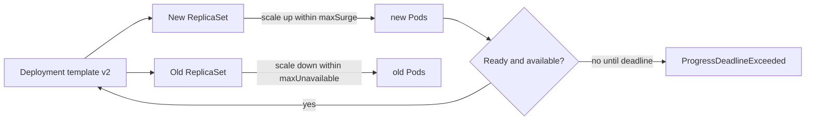

# Day 16 · Deployment, ReplicaSet, rollout, and rollback

## Outcome

Understand how a Deployment manages ReplicaSets, how rolling-update math works, and how to diagnose a rollout that cannot progress.



A Deployment revision is created when its Pod template changes, not when only the replica count changes. The Deployment controller manages ReplicaSets; each ReplicaSet manages Pods matching its immutable selector/template hash.

For rolling updates:

- `maxSurge` controls temporary Pods above desired replicas.
- `maxUnavailable` controls how many desired replicas may be unavailable.
- readiness determines endpoint eligibility; `minReadySeconds` can require stable readiness before availability.
- `progressDeadlineSeconds` reports stalled progress but does not automatically roll back.
- `revisionHistoryLimit` bounds retained old ReplicaSets.

Capacity must accommodate surge requests, anti-affinity, topology, quotas, and volumes. A mathematically safe strategy can still deadlock against real capacity.

## Lab · Follow a revision

```console
helm upgrade k8s-30d labs/kubernetes-internals --namespace default --reuse-values --set labs.web.enabled=true
kubectl rollout status deployment/web -n k8s-30d
kubectl rollout history deployment/web -n k8s-30d
kubectl get replicaset -n k8s-30d -l app=web
kubectl set env deployment/web -n k8s-30d COURSE_REVISION=two
kubectl rollout status deployment/web -n k8s-30d
kubectl rollout history deployment/web -n k8s-30d
```

Pause and batch changes into one rollout:

```console
kubectl rollout pause deployment/web -n k8s-30d
kubectl set env deployment/web -n k8s-30d FEATURE_X=true
kubectl set resources deployment/web -n k8s-30d --requests=cpu=30m,memory=40Mi
kubectl rollout resume deployment/web -n k8s-30d
kubectl rollout status deployment/web -n k8s-30d
```

## Break/fix · Stuck rollout

```console
kubectl set image deployment/web -n k8s-30d nginx=invalid.example.invalid/nginx:nope
kubectl rollout status deployment/web -n k8s-30d --timeout=45s
kubectl get deployment,replicaset,pod -n k8s-30d -l app=web
kubectl describe deployment web -n k8s-30d
kubectl get events -n k8s-30d --sort-by='.metadata.creationTimestamp'
kubectl rollout undo deployment/web -n k8s-30d
kubectl rollout status deployment/web -n k8s-30d
```

Check that old ready Pods remained because `maxUnavailable: 0`. This is availability protection, but it also requires surge capacity.

## Production issues

- **Rollout stuck at one surge Pod:** insufficient requested capacity, quota, affinity, taints, PVC, or pull failure.
- **All new Pods running but unavailable:** readiness failure or `minReadySeconds`; inspect conditions and probe results.
- **Selector change rejected:** Deployment selectors are immutable; use a migration/new workload rather than destructive mutation.
- **Traffic errors during rollout:** readiness is too weak, shutdown is not graceful, endpoints lag, or old/new versions are incompatible.
- **Rollback does not fix data:** Deployments restore Pod templates, not database schema or external state. Plan backward compatibility.

## Interview practice

1. **Deployment versus ReplicaSet?** ReplicaSet maintains a Pod count for one template; Deployment manages ReplicaSet revisions and rollout strategy.
2. **What makes a rollout safe?** Correct readiness, graceful termination, resource capacity, disruption math, backward compatibility, observability, and rollback criteria.
3. **Does progress deadline roll back automatically?** No; it marks failure. Automation or an operator must choose rollback.
4. **Why can maxUnavailable zero deadlock?** Every old Pod must remain while a surge Pod schedules and becomes available; without capacity, no transition is possible.
