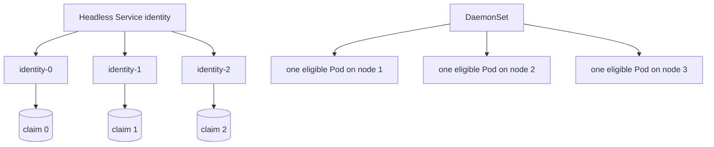

# Day 17 · StatefulSet and DaemonSet

## Outcome

Choose StatefulSet for stable identity/ordered lifecycle and DaemonSet for per-node responsibility, without assuming either magically makes software stateful or highly available.



StatefulSet gives each replica a stable ordinal name, stable network identity through a governing Service, ordered/default creation and update, and stable claim association when using `volumeClaimTemplates`. It does not configure replication, quorum, leader election, backups, or safe membership changes for the application.

`podManagementPolicy: OrderedReady` prioritizes ordering; `Parallel` relaxes it. RollingUpdate proceeds in reverse ordinal order by default and can partition updates for staged rollout. Deleting a StatefulSet does not normally delete its PVCs; retention policies can adjust behavior—verify before operation.

A DaemonSet schedules Pods on every eligible node or matching subset. Common uses are CNI agents, log/metric collectors, CSI node plugins, security agents, and proxies. Tolerations are often required for node/system roles, but broad tolerations increase blast radius.

## Lab · Identity and per-node placement

```powershell
kubectl apply -f labs/manifests/05-workloads.yaml
kubectl get statefulset,daemonset -n k8s-30d
kubectl get pod -n k8s-30d -l app=identity -o wide
kubectl get pod -n k8s-30d -l app=node-agent -o wide
kubectl exec identity-0 -n k8s-30d -- hostname
kubectl exec identity-1 -n k8s-30d -- cat /state/identity
kubectl run dns-stateful -n k8s-30d --image=busybox:1.36.1 --restart=Never -- nslookup identity-0.identity
```

Delete `identity-1`, watch ordered identity recovery, and compare UID/node:

```powershell
kubectl get pod identity-1 -n k8s-30d -o custom-columns=UID:.metadata.uid,NODE:.spec.nodeName
kubectl delete pod identity-1 -n k8s-30d
kubectl get pod -n k8s-30d -l app=identity -w
kubectl exec identity-1 -n k8s-30d -- cat /state/identity
```

The sample uses `emptyDir`, so the identity text is regenerated. In production, use `volumeClaimTemplates` for stable data and test recovery. Scale the StatefulSet and notice ordinal behavior:

```powershell
kubectl scale statefulset/identity -n k8s-30d --replicas=5
kubectl get pod -n k8s-30d -l app=identity -w
```

## Production issues

- **Stateful rollout blocked:** one ordinal is not Ready, so later progression stops. Inspect that Pod, storage, peer membership, and partition strategy.
- **Force-delete risk:** two instances may believe they own the same identity/storage if the old node is merely partitioned. Confirm fencing.
- **DaemonSet missing nodes:** inspect node selector/affinity, taints, tolerations, architecture, image, and desired/current/misscheduled counts.
- **Agent update overload:** tune DaemonSet rolling update `maxUnavailable`/surge where supported and preserve node observability/networking.
- **Quorum operation:** coordinate Kubernetes rollout with application membership and failure-domain rules.

## Interview practice

1. **Deployment versus StatefulSet?** Deployment provides interchangeable replicas; StatefulSet adds stable ordinal identity, ordered lifecycle, and claim association.
2. **Why a headless Service?** It exposes individual endpoint DNS identities without a virtual-IP load balancer.
3. **When use DaemonSet?** For a per-node function such as network, storage, logging, monitoring, or security agents.
4. **Does StatefulSet guarantee data safety?** No. Storage durability, replication, quorum, backups, and recovery belong to the application/storage design.

