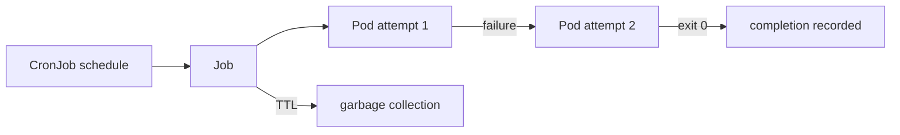

# Day 18 · Jobs and CronJobs

## Outcome

Operate finite work with retries, completion semantics, deadlines, concurrency policy, history, and idempotency.



A Job succeeds when its required completions finish. `parallelism` controls concurrent Pods; `completions` controls successful units. `backoffLimit` bounds retries at the Job level; container `restartPolicy` must be `Never` or `OnFailure`. `activeDeadlineSeconds` bounds wall-clock execution.

CronJob creates Jobs according to a controller-observed schedule. It is not a real-time scheduler: controller downtime, clock behavior, and delayed reconciliation matter. `concurrencyPolicy` is `Allow`, `Forbid`, or `Replace`. `startingDeadlineSeconds` limits how late missed executions may start. Design the task to be idempotent because duplicate execution can still occur in distributed systems.

## Lab · Completion and schedule

```powershell
kubectl apply -f labs/manifests/05-workloads.yaml
kubectl get job,cronjob -n k8s-30d
kubectl wait job/report-once -n k8s-30d --for=condition=complete --timeout=120s
kubectl logs job/report-once -n k8s-30d
kubectl describe job report-once -n k8s-30d
kubectl get cronjob heartbeat -n k8s-30d -o yaml
kubectl get job -n k8s-30d --watch
```

Trigger a CronJob manually without waiting:

```powershell
kubectl create job heartbeat-manual -n k8s-30d --from=cronjob/heartbeat
kubectl wait job/heartbeat-manual -n k8s-30d --for=condition=complete --timeout=120s
kubectl logs job/heartbeat-manual -n k8s-30d
```

Create a failure and observe retry/backoff:

```powershell
kubectl create job fail-demo -n k8s-30d --image=busybox:1.36.1 -- sh -c 'echo attempt; exit 7'
kubectl get pod -n k8s-30d -l job-name=fail-demo -w
kubectl describe job fail-demo -n k8s-30d
kubectl delete job fail-demo heartbeat-manual -n k8s-30d --ignore-not-found
```

## Practical design

- Use a durable work key and transactional/idempotent write so retry does not duplicate money, email, or data mutations.
- Emit progress externally; Pod logs and status alone are weak checkpoints for long jobs.
- Set resource requests/limits, deadlines, history, and TTL to prevent abandoned batch workloads consuming the cluster.
- Suspend CronJobs before maintenance or risky migrations, then decide deliberately whether missed work should catch up.
- Account for time zone configuration and daylight-saving behavior; UTC is often simplest.

## Production issues

| Symptom | Evidence and response |
|---|---|
| Job never completes | Pod exit codes, active count, backoff, deadline, finalizers |
| repeated duplicate output | attempt count and business key; fix idempotency/locking |
| CronJob skipped | suspend flag, last schedule, deadline, controller health, clock/time zone |
| too many Jobs/Pods | history/TTL, stuck finalizers, controller health |
| Forbid blocks future run | prior Job still Active; determine whether it is genuinely alive or stuck |

## Interview practice

1. **Job versus Deployment?** Job drives finite successful completion; Deployment maintains continuously available interchangeable replicas.
2. **Job versus CronJob?** CronJob schedules Job objects; Job manages Pod attempts and completion.
3. **Does Forbid guarantee exactly once?** No. It prevents controller-created overlapping Jobs, not every distributed duplicate. Build idempotent processing.
4. **Never versus OnFailure?** `OnFailure` restarts containers within a Pod; `Never` leaves a failed Pod and Job creates another attempt, improving per-attempt evidence.

