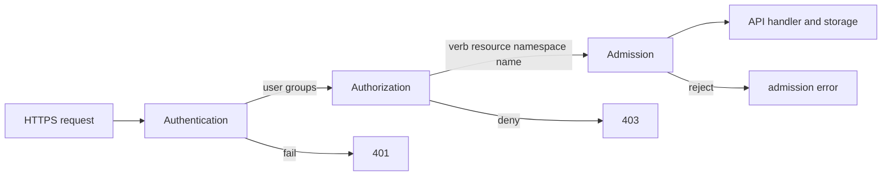

# Day 19 · Authentication, authorization, ServiceAccounts, and RBAC

## Outcome

Separate identity verification from permission decisions, build least-privilege RBAC, and diagnose 401 versus 403.



Kubernetes does not store ordinary human `User` objects. Authentication can use client certificates, OIDC/JWT, webhook tokens, or provider integrations. The result is a username and groups. ServiceAccounts are namespaced API identities intended for workloads; projected bound tokens are short-lived and audience-scoped when configured correctly.

RBAC evaluates allowed attributes:

- Role: namespaced permissions.
- ClusterRole: cluster-scoped definition, usable cluster-wide or bound into one namespace.
- RoleBinding: grants a Role or ClusterRole within a namespace.
- ClusterRoleBinding: grants across the cluster.

Rules are additive allow rules; RBAC has no explicit deny. Avoid wildcards, `cluster-admin`, unrestricted Secret access, Pod creation in privileged namespaces, and unsafe `bind`, `escalate`, or impersonation rights. Permission to create Pods can indirectly expose ServiceAccount credentials and node resources.

## Lab · Least privilege

```console
helm upgrade k8s-30d labs/kubernetes-internals --namespace default --reuse-values --set labs.rbac.enabled=true
kubectl auth can-i list pods -n k8s-30d --as=system:serviceaccount:k8s-30d:pod-reader
kubectl auth can-i get pods/log -n k8s-30d --as=system:serviceaccount:k8s-30d:pod-reader
kubectl auth can-i create pods -n k8s-30d --as=system:serviceaccount:k8s-30d:pod-reader
kubectl auth can-i get secrets -n k8s-30d --as=system:serviceaccount:k8s-30d:pod-reader
kubectl auth can-i get configmap/web-content -n k8s-30d --as=system:serviceaccount:k8s-30d:pod-reader
kubectl auth can-i --list -n k8s-30d --as=system:serviceaccount:k8s-30d:pod-reader
```

Inspect the exact binding chain:

```console
kubectl get serviceaccount,role,rolebinding -n k8s-30d -o yaml
kubectl create token pod-reader -n k8s-30d --duration=10m
```

Treat the printed token as a credential; do not paste it into notes or source control. Delete the lab and let the short-lived token expire.

## Practical issues

- **401:** confirm kubeconfig context, credential plugin, token expiry/audience/issuer, client certificate dates, and API trust chain.
- **403:** read the full error for identity, verb, resource, subresource, and namespace; verify with `kubectl auth can-i` under impersonation.
- **RoleBinding to ClusterRole:** permissions remain limited to the binding namespace; useful for reusable role definitions.
- **ServiceAccount token missing:** automount may be disabled; explicitly project a token only for workloads that call the API.
- **Permission works unexpectedly:** inspect all RoleBindings/ClusterRoleBindings and group membership; additive grants often hide elsewhere.

## Production controls

Use identity-provider groups instead of individual bindings; time-bound privileged access; audit administrative verbs; periodically enumerate high-risk permissions; disable anonymous access where possible; rotate credentials; separate deployment identities by namespace/environment; and alert on new cluster-admin bindings.

## Interview practice

1. **Authentication versus authorization?** Authentication establishes identity; authorization decides whether that identity may perform the requested action.
2. **User versus ServiceAccount?** Human users are external identities; ServiceAccounts are namespaced Kubernetes workload identities.
3. **RoleBinding to ClusterRole versus ClusterRoleBinding?** The former grants selected rules only inside one namespace; the latter grants at cluster scope.
4. **Why is Secret read dangerous?** It can expose credentials and enable lateral movement; Pod creation/exec may also indirectly reach secrets.
5. **How do you debug Forbidden?** Extract identity/verb/resource/namespace, test `auth can-i`, trace bindings and group membership, then add the narrowest justified permission.
