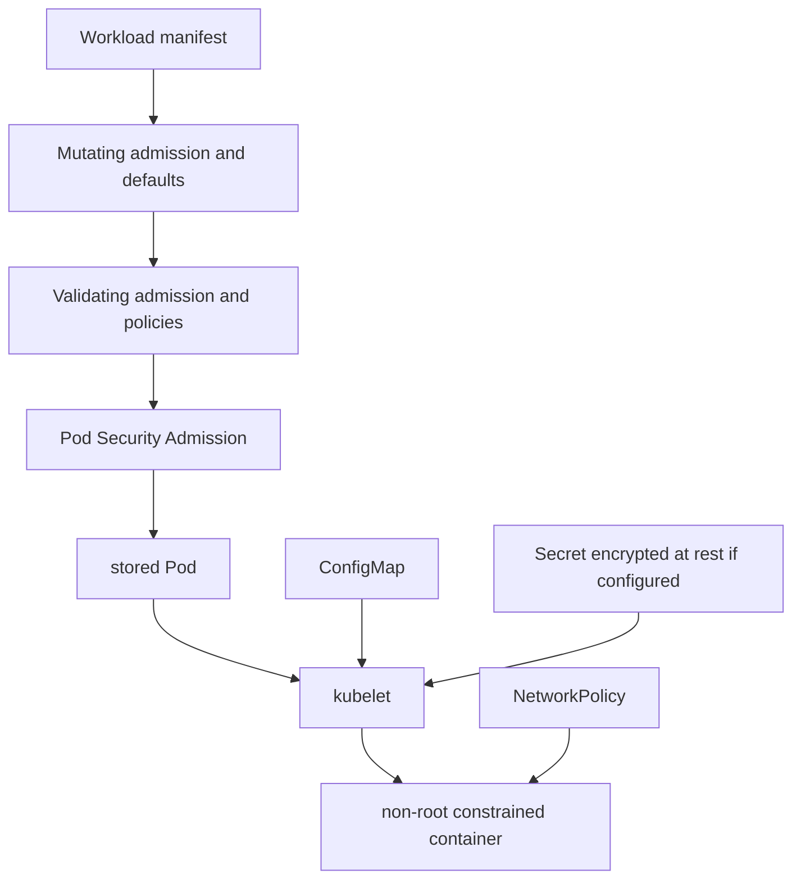

# Day 20 · Secrets, ConfigMaps, Pod security, admission, and network isolation

## Outcome

Build layered workload guardrails: safe configuration delivery, Secret handling, Pod Security Standards, admission control, security contexts, and NetworkPolicy.



ConfigMaps hold non-confidential configuration. Secrets use base64 in YAML/API representation; base64 is not encryption. Protect Secrets with TLS in transit, API encryption at rest using a managed key strategy, least-privilege RBAC, short-lived external identity where possible, audit, and careful application logging.

Mounted ConfigMap/Secret volumes can update eventually, but `subPath` mounts do not receive live updates. Environment variables are fixed at process start. Applications must reload safely; many teams trigger a rollout using a configuration checksum.

Pod Security Standards define `Privileged`, `Baseline`, and `Restricted` profiles. Pod Security Admission can enforce, warn, and audit a chosen version at namespace scope. A restricted workload generally needs non-root execution, no privilege escalation, dropped capabilities, an allowed seccomp profile, and safe volume/host settings.

Admission controllers run after authorization and can mutate or validate requests. Dynamic webhooks add external failure and latency dependencies; keep them fast, highly available, narrowly scoped, observable, and explicit about failure policy.

## Lab · Secure a workload

```console
helm upgrade k8s-30d labs/kubernetes-internals --namespace default --reuse-values --set labs.security.enabled=true
kubectl get pod restricted-web -n k8s-30d -o yaml
kubectl exec restricted-web -n k8s-30d -- id
kubectl exec restricted-web -n k8s-30d -- sh -c 'touch /should-fail'
kubectl get networkpolicy -n k8s-30d
kubectl get namespace k8s-30d --show-labels
```

Create and inspect a Secret without printing it in shared output:

```console
kubectl create secret generic demo-credential -n k8s-30d --from-literal=username=course --from-literal=password='local-only'
kubectl describe secret demo-credential -n k8s-30d
kubectl auth can-i get secrets -n k8s-30d --as=system:serviceaccount:k8s-30d:pod-reader
kubectl delete secret demo-credential -n k8s-30d
```

Test enforcement in an isolated namespace:

```console
kubectl create namespace pss-test
kubectl label namespace pss-test pod-security.kubernetes.io/enforce=restricted
kubectl run root-test -n pss-test --image=nginx:1.27-alpine
kubectl delete namespace pss-test
```

The default Pod should be rejected. Read the error and list every missing control.

## Production issues

| Issue | Response |
|---|---|
| Secret committed to Git | revoke/rotate first, then purge exposure and investigate access; deletion from latest commit is insufficient |
| webhook outage blocks all Pods | inspect scope, endpoints, TLS, timeout, failurePolicy; use a pre-approved break-glass runbook |
| restricted policy breaks legacy app | identify exact privilege, redesign image/ports/filesystem, stage warn/audit before enforce |
| config changed but app stale | determine env vs volume vs subPath and reload mechanism |
| default-deny breaks DNS | allow required egress to DNS for UDP/TCP 53 and verify resolver path |

## Interview practice

1. **Are Kubernetes Secrets encrypted?** Not merely because they are Secret objects; base64 is encoding. Configure encryption at rest and protect access/transport.
2. **Admission versus authorization?** Authorization decides whether the caller may act; admission validates or mutates the proposed object after authorization.
3. **Why Pod Security Standards?** They provide consistent workload hardening profiles; admission can enforce them without the removed PodSecurityPolicy API.
4. **ConfigMap update behavior?** Volume projections update eventually except `subPath`; environment values require restart; the application must reload.
5. **How do security layers combine?** Identity/RBAC controls API actions, admission controls object shape, runtime security limits processes, NetworkPolicy limits reachability, and secrets controls protect data.
