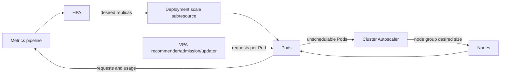

# Day 21 · HPA, VPA, Metrics Server, and Cluster Autoscaler

## Outcome

Explain the different control loops for replica count, resource sizing, and node capacity; run an HPA and diagnose missing or unstable metrics.



## Control loops

For resource utilization, HPA approximately calculates:

```text
desiredReplicas = ceil(currentReplicas × currentMetricValue / desiredMetricValue)
```

CPU utilization is usage divided by the Pod's CPU **request**, so missing or unrealistic requests corrupt scaling behavior. The controller also handles tolerance, missing metrics, startup/readiness, stabilization windows, and rate policies to avoid flapping. `autoscaling/v2` supports multiple resource, object, Pods, and external metrics; the largest proposed replica count wins.

Metrics Server provides the resource metrics API used by `kubectl top` and basic CPU/memory HPA. It is not a long-term monitoring database. Custom/external metrics require appropriate adapters/providers.

VPA recommends or changes container requests; update modes can require eviction/recreation depending on capability. Do not let HPA and VPA both control the same CPU/memory signal without a deliberate design. Cluster Autoscaler reacts to Pods that cannot schedule and to underutilized removable nodes; it does not add nodes merely because average CPU is high.

## Lab · Generate an HPA decision

```console
kubectl top nodes
helm upgrade k8s-30d labs/kubernetes-internals --namespace default --reuse-values --set labs.scalingReliability.enabled=true
kubectl get deployment,hpa,pdb -n k8s-30d
kubectl describe hpa scalable-web -n k8s-30d
kubectl top pods -n k8s-30d -l app=scalable-web
```

If metrics are available, generate load:

```console
kubectl run load-generator -n k8s-30d --image=busybox:1.36.1 --restart=Never -it --rm -- sh -c 'while sleep 0.01; do wget -q -O- http://scalable-web; done'
```

In a second terminal:

```console
kubectl get hpa,pod -n k8s-30d -w
kubectl describe hpa scalable-web -n k8s-30d
```

Stop load with Ctrl+C. Observe stabilization before scale-down rather than assuming it is stuck.

## Break/fix · Unknown metric

Temporarily remove CPU requests from the Deployment:

```console
kubectl set resources deployment/scalable-web -n k8s-30d --requests=memory=32Mi
kubectl describe hpa scalable-web -n k8s-30d
helm upgrade k8s-30d labs/kubernetes-internals --namespace default --reuse-values --set labs.scalingReliability.enabled=true
```

Explain why CPU utilization cannot be calculated for Pods without a CPU request.

## Production issues

- **HPA shows `<unknown>`:** inspect resource metrics API, Metrics Server, adapter, Pod requests, selectors, and readiness.
- **Scaling lags:** metric scrape/adapter delay, HPA sync, Pod startup/readiness, scheduler, image pull, and node provisioning all add latency.
- **Thrashing:** noisy metric, tight thresholds, no stabilization, poor requests, or workload feedback loop.
- **HPA at max but latency high:** inspect saturation and dependency bottlenecks; replicas may not solve database/lock/network limits.
- **Cluster Autoscaler does nothing:** Pod might be unschedulable for a constraint no node group can satisfy; inspect reason and template labels/taints/limits.
- **Scale-down blocked:** PDB, local storage, safe-to-evict policy, daemon/system Pods, or node-group minimum.

## Interview practice

1. **HPA versus Cluster Autoscaler?** HPA changes workload replicas; Cluster Autoscaler changes nodes based on scheduling needs and removable capacity.
2. **How does HPA calculate replicas?** Give the ratio formula, then mention requests, tolerance, missing metrics, and stabilization.
3. **Why Metrics Server?** It implements resource metrics for `top` and resource-based autoscaling; not durable observability.
4. **HPA versus VPA?** HPA changes replica count; VPA changes per-Pod requests. Coordinate signals to avoid conflicting loops.
