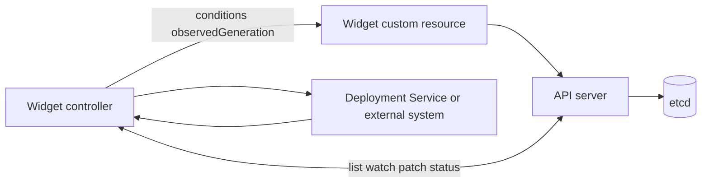

# Day 23 · CRDs, controllers, and the Operator pattern

## Outcome

Extend the Kubernetes API safely and describe how an Operator encodes domain-specific reconciliation instead of becoming a collection of imperative scripts.



A CustomResourceDefinition adds a resource type to API discovery with schemas, versions, scope, subresources, and conversion strategy. A Custom Resource is an instance. A controller provides behavior; without it, the object is simply stored data.

An Operator combines CRDs and controllers to encode operational knowledge such as provisioning, upgrades, failover, backup, or membership. Good API design is declarative: users specify intent, while status communicates observed state and conditions.

Production CRDs need structural schemas, defaulting/validation, pruning expectations, status subresource, scale subresource when appropriate, version conversion, compatibility policy, and careful deletion. Do not expose every implementation knob as API; define a stable contract.

## Lab · Add an API type

```console
helm upgrade k8s-30d labs/kubernetes-internals --namespace default --reuse-values --set labs.crd.enabled=true
kubectl wait customresourcedefinition/widgets.course.example.com --for=condition=Established --timeout=60s
helm upgrade k8s-30d labs/kubernetes-internals --namespace default --reuse-values --set labs.crd.widget.enabled=true
kubectl api-resources --api-group=course.example.com
kubectl explain widget
kubectl explain widget.spec
kubectl get widget demo -n k8s-30d -o yaml
kubectl get --raw /apis/course.example.com/v1alpha1/namespaces/k8s-30d/widgets
```

Prove schema validation:

```console
kubectl patch widget demo -n k8s-30d --type=merge -p '{"spec":{"replicas":99}}'
kubectl patch widget demo -n k8s-30d --type=merge -p '{"spec":{"replicas":3}}'
```

Simulate one reconciliation by creating a child from desired state and writing status as a controller identity would:

```console
kubectl create deployment widget-demo -n k8s-30d --image=nginx:1.27-alpine --replicas=3
kubectl patch widget demo -n k8s-30d --subresource=status --type=merge -p '{"status":{"observedGeneration":1,"readyReplicas":3,"conditions":[{"type":"Ready","status":"True","reason":"ChildrenReady","message":"All child replicas are ready"}]}}'
kubectl get widget demo -n k8s-30d -o yaml
```

If the API/server does not support the generic subresource patch syntax in your client, use `kubectl proxy` and a direct status endpoint only on the disposable cluster. The key lesson: spec and status have distinct ownership.

## Reconciliation design exercise

Write pseudocode for a level-triggered reconciler:

```text
read the latest Widget
if deleting: perform bounded cleanup; remove finalizer; return
ensure finalizer exists
calculate desired children from Widget.spec
create or patch owned children idempotently
observe child readiness
patch Widget.status.conditions and observedGeneration
requeue only when time-based work is required
```

Handle “already exists,” conflicts, duplicate events, partial external failures, and deletion at every step.

## Production issues

- CRD exists but nothing happens: no healthy controller, wrong watch namespace/RBAC, or reconciliation error.
- Status stale: compare `metadata.generation` with `status.observedGeneration`; inspect controller queue/retries.
- Upgrade breaks old objects: storage version/conversion/schema compatibility was not planned.
- Reconcile storm: controller writes unchanged data, watches its own status changes, or lacks backoff.
- Operator has excessive privileges: scope RBAC to exact resources/namespaces and separate install from runtime rights.

## Interview practice

1. **What is a CRD?** It extends API discovery/storage/schema with a custom type; it does not provide behavior by itself.
2. **What is the Operator pattern?** A domain-specific controller continuously reconciles custom desired state into Kubernetes/external operations.
3. **Why status subresource?** It separates controller-owned observation from user-owned intent and supports distinct authorization/generation behavior.
4. **Why observedGeneration?** It tells consumers whether status reflects the current spec generation.
