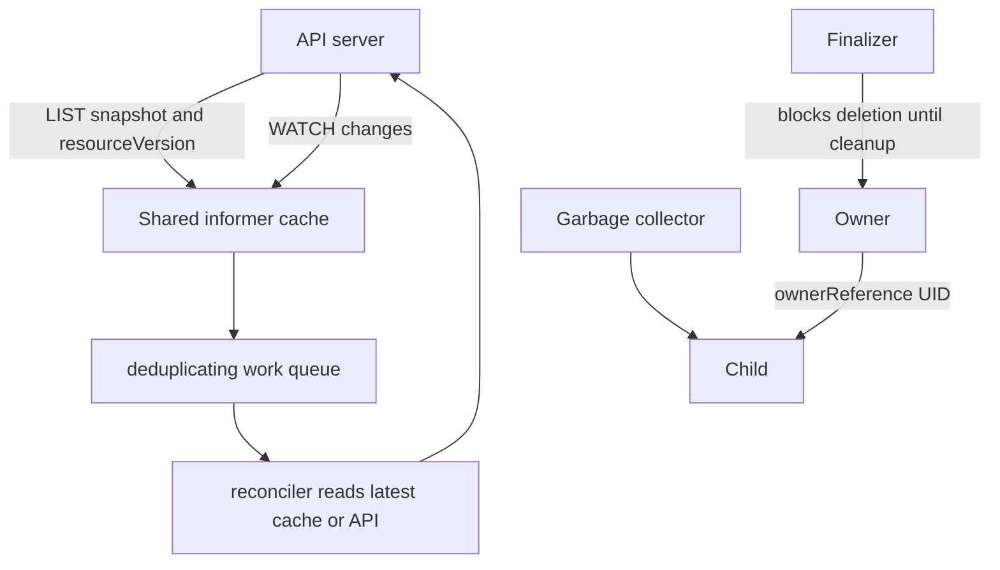

# Day 24 · Watches, informers, owner references, finalizers, garbage collection, and webhooks

## Outcome

Understand the machinery that makes controllers efficient and deletion safe—and diagnose stuck terminating objects and admission outages.



## Internals

A watch streams changes after a resource version. Clients must handle disconnects, bookmarks, expired/compacted history, and relist. Informers combine list/watch with a local cache, event handlers, resync behavior, and shared connections. Controllers enqueue object keys, then read the latest state; events are hints, not a guaranteed one-time command stream.

Owner references identify a parent by UID. Garbage collection can remove dependents using foreground, background, or orphan propagation. Cross-namespace ownership is restricted and cluster/namespaced scope rules matter.

Deletion first sets `deletionTimestamp`. Finalizers are names in metadata that keep the object until responsible controllers complete cleanup and remove their key. A finalizer is not a hook that executes itself. Never remove an unknown production finalizer before understanding the external resource/leak/safety consequence.

Mutating and validating admission webhooks receive AdmissionReview requests. They must be fast, TLS-correct, highly available, narrowly selected, idempotent for mutation, and observable. `failurePolicy: Fail` protects invariants but can block the cluster; `Ignore` preserves availability but may admit unsafe objects.

## Lab A · Watch events and ownership

```console
helm upgrade k8s-30d labs/kubernetes-internals --namespace default --reuse-values --set labs.web.enabled=true
kubectl get pod -n k8s-30d -l app=web --watch --output-watch-events
```

In another terminal, scale the Deployment and examine UID-based ownership:

```console
kubectl scale deployment/web -n k8s-30d --replicas=4
kubectl get deployment,replicaset,pod -n k8s-30d -l app=web -o yaml
kubectl delete deployment web -n k8s-30d --cascade=orphan
kubectl get replicaset,pod -n k8s-30d -l app=web
```

Orphaning demonstrates propagation. Restore the managed Deployment with the chart upgrade:

```console
helm upgrade k8s-30d labs/kubernetes-internals --namespace default --reuse-values --set labs.web.enabled=true
```

## Lab B · Stuck finalizer

```console
helm upgrade k8s-30d labs/kubernetes-internals --namespace default --reuse-values --set labs.crd.enabled=true
kubectl wait customresourcedefinition/widgets.course.example.com --for=condition=Established --timeout=60s
helm upgrade k8s-30d labs/kubernetes-internals --namespace default --reuse-values --set labs.crd.widget.enabled=true
kubectl patch widget demo -n k8s-30d --type=merge -p '{"metadata":{"finalizers":["course.example.com/cleanup"]}}'
kubectl delete widget demo -n k8s-30d --wait=false
kubectl get widget demo -n k8s-30d -o yaml
```

The CR remains terminating because no controller performs cleanup. In this controlled lab only, simulate completed cleanup:

```console
kubectl patch widget demo -n k8s-30d --type=merge -p '{"metadata":{"finalizers":[]}}'
kubectl get widget demo -n k8s-30d
```

Clean the cluster-scoped CRD after both Day 23 and 24:

```console
helm upgrade k8s-30d labs/kubernetes-internals --namespace default --reuse-values --set labs.crd.widget.enabled=false --set labs.crd.enabled=false
```

## Production issues

- **Watch closes with expired resource version:** relist, rebuild cache, resume; client libraries/informers handle this when used correctly.
- **API overloaded by controllers:** share informers, scope watches, avoid full-list polling, use pagination, and prevent no-op status writes.
- **Namespace stuck Terminating:** inspect namespace conditions, unavailable APIService/discovery, remaining resources, and finalizers before any forced finalize.
- **Webhook blocks Pod creation:** inspect API audit/latency, webhook Service endpoints, DNS/TLS/SAN/CA, timeout, selectors, and failure policy.
- **Children deleted unexpectedly:** inspect owner UID, controller flag, propagation policy, and competing managers.

## Interview practice

1. **Why watches instead of polling?** They deliver incremental changes after a version, reducing repeated reads and latency; resilient clients still relist when necessary.
2. **What are informers?** Shared list/watch caches with handlers that let controllers process keys efficiently and read latest state.
3. **What is a finalizer?** A deletion gate owned by a controller for external/invariant cleanup; it is not executable code.
4. **Owner reference versus label?** Owner reference encodes UID-based lifecycle/GC ownership; labels are query/grouping metadata.
5. **Fail versus Ignore webhook policy?** Trade invariant enforcement against API availability; decide per risk and build HA/monitoring either way.
