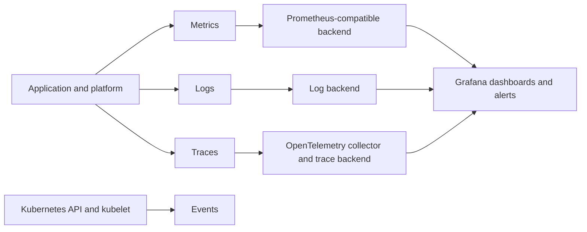

# Day 25 · Observability with metrics, logs, traces, and events

## Outcome

Create a production signal map using Prometheus/Grafana concepts and OpenTelemetry, then triage one latency incident across workload and control-plane layers.



## Signal roles

- **Metrics:** aggregatable trends, SLOs, alerting, saturation, rates, percentiles. Watch label cardinality.
- **Logs:** detailed discrete context. Use structured fields, correlation IDs, redaction, retention, and sampling.
- **Traces:** request path and latency across services. Sampling and propagation design determine value.
- **Events:** short-lived Kubernetes control-plane breadcrumbs, not a durable audit/log system.
- **Audit logs:** who called the Kubernetes API and what was allowed; sensitive and high-volume, so configure policy carefully.

Use RED (rate, errors, duration) for request-serving services and USE (utilization, saturation, errors) for resources. Tie alerts to user impact/SLO burn where possible, then use cause-oriented signals for diagnosis. A dashboard without a decision or runbook is decoration.

## Lab A · Native signals

```powershell
kubectl apply -f labs/manifests/01-web.yaml
kubectl top nodes
kubectl top pods -n k8s-30d
kubectl logs -n k8s-30d -l app=web --all-containers --prefix --tail=50
kubectl get events -n k8s-30d --sort-by='.metadata.creationTimestamp'
kubectl get --raw /metrics | Select-Object -First 20
kubectl get --raw /apis/metrics.k8s.io/v1beta1/nodes
```

API `/metrics` may be forbidden on managed clusters; that is a valid RBAC boundary, not a reason to grant yourself broad access.

## Lab B · Optional Prometheus/Grafana stack

On a disposable cluster with enough memory and internet access:

```powershell
helm repo add prometheus-community https://prometheus-community.github.io/helm-charts
helm repo update
helm upgrade --install monitoring prometheus-community/kube-prometheus-stack --namespace monitoring --create-namespace
kubectl get pods -n monitoring
kubectl port-forward -n monitoring service/monitoring-grafana 3000:80
```

Read the chart values and pin a reviewed version for repeatable production use. Do not copy default credentials/configuration into production. Remove with `helm uninstall monitoring -n monitoring` and then review namespace/PVC retention.

## Incident exercise · Latency spike

Follow a hypothesis tree:

1. Confirm user impact: request rate, error ratio, duration distribution, affected route/region/version.
2. Check workload saturation: CPU throttling, memory/GC, queue depth, replicas, readiness, restarts.
3. Check dependency spans/logs: DNS, network, database, external API.
4. Check cluster transitions: scheduling delay, node pressure, rollout, HPA, CNI/CSI, API events.
5. Mitigate reversibly: stop rollout, scale if it addresses saturation, route away, disable expensive feature.
6. Validate recovery against the original user signal, then preserve a timeline.

## Production issues

- High-cardinality labels can exhaust metric backends; never use unbounded user/request IDs as metric labels.
- Logging every request at peak can worsen an outage through CPU, disk, and network load.
- Average latency hides tail pain; use histograms and appropriate percentiles/SLO windows.
- Missing telemetry is itself a signal; alert on scrape/collector/agent health without creating recursive noise.
- Clock skew breaks event/trace correlation; maintain time synchronization.
- `kubectl logs --previous` is essential after restart, but centralized retention should preserve evidence longer.

## Interview practice

1. **Metrics versus logs versus traces?** Explain aggregation/trends, detailed events, and request causality; use them together from symptom to cause.
2. **What should you monitor for Kubernetes?** User SLOs, workloads, nodes, API/etcd/scheduler/controllers, DNS/network, storage, autoscaling, and telemetry health.
3. **Why not rely on Kubernetes Events?** They are namespaced, aggregated/limited, and short-retention operational hints, not durable logs/audit.
4. **What does OpenTelemetry add?** Vendor-neutral APIs/SDKs and collector pipelines for traces, metrics, and logs with consistent context propagation.
5. **How do you alert well?** Page on actionable user-impact or fast SLO burn; route lower urgency; include ownership, evidence, and runbook.

