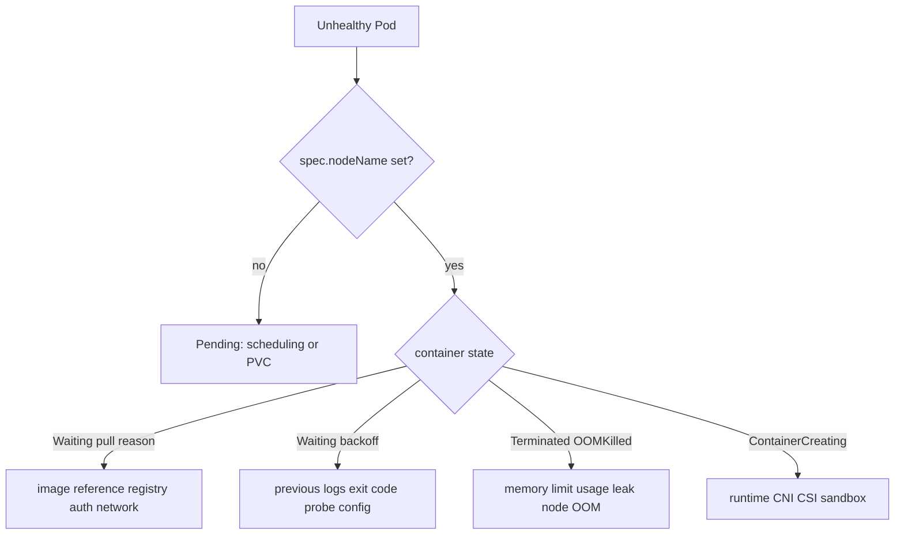

# Day 26 · Pod incidents: Pending, CrashLoopBackOff, ImagePullBackOff, OOMKilled

## Outcome

Diagnose four common Pod failures from status, events, logs, and node evidence without reading the deliberately broken manifest first.



`CrashLoopBackOff` and `ImagePullBackOff` are backoff states, not root causes. Read `state`, `lastState`, reason, message, exit code, restart count, events, and previous logs.

## Lab setup

```powershell
kubectl apply -f labs/manifests/09-failures.yaml
kubectl get pod -n k8s-30d -l failure -w
```

Wait several minutes for the OOM and backoff states. Do not open `09-failures.yaml` until you record a hypothesis for each Pod.

## Incident 1 · Pending

```powershell
kubectl get pod failure-pending -n k8s-30d -o wide
kubectl get pod failure-pending -n k8s-30d -o jsonpath='{.status.conditions[*].message}'
kubectl describe pod failure-pending -n k8s-30d
kubectl get nodes --show-labels
kubectl get events -n k8s-30d --field-selector involvedObject.name=failure-pending
```

Repair this lab by satisfying the deliberate selector, then remove the temporary label after deleting the Pod:

```powershell
$node = kubectl get node -o jsonpath='{.items[0].metadata.name}'
kubectl label node $node course.example.com/nonexistent=true
kubectl get pod failure-pending -n k8s-30d -w
kubectl delete pod failure-pending -n k8s-30d
kubectl label node $node course.example.com/nonexistent-
```

## Incident 2 · CrashLoopBackOff

```powershell
kubectl get pod failure-crashloop -n k8s-30d -o jsonpath='{.status.containerStatuses[0].lastState.terminated}'
kubectl logs failure-crashloop -n k8s-30d
kubectl logs failure-crashloop -n k8s-30d --previous
kubectl describe pod failure-crashloop -n k8s-30d
```

The exit code/message proves an application/configuration failure. In a controller-managed workload, correct the template and roll out. This standalone Pod's command is immutable, so recreate a corrected Pod:

```powershell
kubectl delete pod failure-crashloop -n k8s-30d
kubectl run failure-crashloop -n k8s-30d --image=busybox:1.36.1 -- sleep 1d
```

## Incident 3 · ImagePullBackOff

```powershell
kubectl describe pod failure-imagepull -n k8s-30d
kubectl get events -n k8s-30d --field-selector involvedObject.name=failure-imagepull
kubectl get pod failure-imagepull -n k8s-30d -o jsonpath='{.spec.containers[0].image}{"`n"}'
kubectl get serviceaccount default -n k8s-30d -o yaml
```

Classify exact failure: not found, unauthorized, DNS, TLS, rate limit, platform mismatch, or runtime connectivity. Repair the image reference:

```powershell
kubectl set image pod/failure-imagepull -n k8s-30d app=busybox:1.36.1
kubectl get pod failure-imagepull -n k8s-30d -w
```

It may complete because BusyBox has no long-running default; that still proves the pull path is repaired.

## Incident 4 · OOMKilled

```powershell
kubectl get pod failure-oom -n k8s-30d -o jsonpath='{.status.containerStatuses[0].lastState.terminated.reason}{" exit="}{.status.containerStatuses[0].lastState.terminated.exitCode}{"`n"}'
kubectl describe pod failure-oom -n k8s-30d
kubectl top pod failure-oom -n k8s-30d --containers
kubectl describe node (kubectl get pod failure-oom -n k8s-30d -o jsonpath='{.spec.nodeName}')
```

Container OOM at its cgroup limit differs from node-level memory pressure/system OOM. Fix the leak/working set, right-size requests and limits from observed distributions, and load-test. Simply increasing the limit may move the outage to the node.

## Production triage rules

- Preserve `--previous` logs before another restart overwrites the evidence window.
- Start with status/events; they often contain exact scheduler, pull, mount, sandbox, or probe errors.
- Compare one failing instance with a healthy sibling, node, revision, and configuration.
- Mitigate with the smallest reversible controller-level change: rollback, scale known-good, correct reference, or route away.
- Verify using the original user signal, not only `Running` phase.

## Interview practice

1. Give a five-step Pending runbook.
2. Why is CrashLoopBackOff not a root cause?
3. How do `ErrImagePull` and `ImagePullBackOff` relate?
4. How do you distinguish cgroup OOM from node memory pressure?
5. A Pod restarts every five minutes—what evidence do you collect before changing it?

