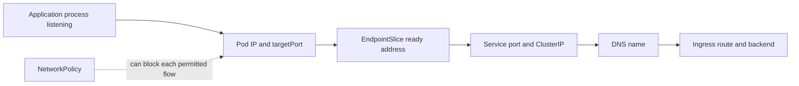

# Day 27 · Network incidents: Service, DNS, policy, and Ingress

## Outcome

Use a deterministic layer-by-layer method for “Service unreachable,” “DNS broken,” “Ingress 502,” and policy regressions.



Always test from the same network identity and namespace as the affected caller. A laptop test does not reproduce Pod DNS search, egress policy, service routing, sidecars, or source identity.

## Baseline

```powershell
kubectl apply -f labs/manifests/01-web.yaml
kubectl run net-client -n k8s-30d --image=nicolaka/netshoot --restart=Never -- sleep 1d
kubectl exec net-client -n k8s-30d -- dig +short web.k8s-30d.svc.cluster.local
kubectl exec net-client -n k8s-30d -- curl -sS http://web
kubectl get service,endpointslice,pod -n k8s-30d -o wide
```

## Incident A · Service selector

```powershell
kubectl patch service web -n k8s-30d --type=merge -p '{"spec":{"selector":{"app":"wrong"}}}'
kubectl exec net-client -n k8s-30d -- curl --connect-timeout 2 http://web
kubectl get service web -n k8s-30d -o yaml
kubectl get endpointslice -n k8s-30d -l kubernetes.io/service-name=web -o yaml
```

Repair and verify endpoint population before retesting traffic:

```powershell
kubectl patch service web -n k8s-30d --type=merge -p '{"spec":{"selector":{"app":"web"}}}'
kubectl get endpointslice -n k8s-30d -l kubernetes.io/service-name=web -w
```

## Incident B · NetworkPolicy

```powershell
kubectl apply -f labs/manifests/07-security.yaml
kubectl exec net-client -n k8s-30d -- curl --connect-timeout 2 http://web
kubectl label pod net-client -n k8s-30d access=web
kubectl exec net-client -n k8s-30d -- curl --connect-timeout 2 http://web
kubectl delete -f labs/manifests/07-security.yaml
```

On a policy-enforcing CNI, the first call should fail and the labeled call succeed. Confirm CNI enforcement if behavior is unchanged.

## DNS runbook

```powershell
kubectl exec net-client -n k8s-30d -- cat /etc/resolv.conf
kubectl exec net-client -n k8s-30d -- dig web.k8s-30d.svc.cluster.local
kubectl exec net-client -n k8s-30d -- dig example.com
kubectl get service,endpointslice -n kube-system -l k8s-app=kube-dns
kubectl get pods -n kube-system -l k8s-app=kube-dns -o wide
kubectl logs -n kube-system -l k8s-app=kube-dns --tail=200
```

Classify cluster-zone-only, upstream-only, one-Pod/one-node, or global failure. Check UDP and TCP 53, conntrack, policy, CoreDNS saturation, upstream latency, and node-local DNS if installed.

## Ingress 502 runbook

1. Reproduce with exact scheme, host/SNI, path, headers, and body.
2. Confirm route/class accepted and controller loaded it.
3. From the controller network context, resolve/curl the backend Service.
4. Inspect EndpointSlice readiness, target port, protocol, and Pod listener.
5. Check controller-to-backend NetworkPolicy and service mesh TLS expectations.
6. Correlate controller access/error log with backend log and request ID.

## Production issues

| Pattern | Likely layer |
|---|---|
| Pod IP fails | app listener, Pod network, policy, sidecar |
| Pod IP works, ClusterIP fails | Service port/dataplane/conntrack |
| ClusterIP works, name fails | DNS/resolver |
| Service works, Ingress fails | route/controller/TLS/backend protocol |
| same node works only | cross-node CNI route/tunnel/firewall/MTU |
| small calls work, large fail | MTU, proxy/body/timeouts, fragmentation |

## Interview practice

1. A Service is unreachable. Walk the exact checks in order.
2. How do you distinguish DNS from kube-proxy failure?
3. Why can NetworkPolicy YAML be correct but unenforced?
4. What commonly causes Ingress 502 versus 404?
5. How would an MTU mismatch present?

