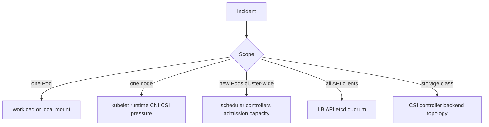

# Day 28 · Node, storage, scheduler, API server, and etcd incidents

## Outcome

Triage infrastructure failures by blast radius and dependency path, then choose a mitigation that preserves quorum, data, and evidence.



## Lab · Six production incident stations

Work through the scenarios below as read-only investigations on a local cluster. For each one, write impact, scope, last successful transition, three decisive evidence points, safe mitigation, and prevention. Do not stop a real control-plane or node service to manufacture failure; use existing symptoms or the failure simulations from Days 26-27.

## Scenario 1 · Node NotReady

```console
kubectl get nodes -o wide
kubectl describe node <node>
kubectl get lease <node> -n kube-node-lease -o yaml
kubectl get pods -A --field-selector spec.nodeName=<node> -o wide
kubectl get events -A --field-selector involvedObject.kind=Node
```

Decide whether the node is powered off, partitioned from API, kubelet stopped, certificate-expired, runtime/disk exhausted, or explicitly reporting pressure. Cordon to prevent new placement if API is available. Before deleting Pods or force-detaching disks, determine whether the old node/process is truly dead to avoid duplicate writers.

## Scenario 2 · kubelet or runtime stopped

Symptoms: Lease stale, `Ready=Unknown`, Pod status stale; containers may still run. On the host, use your service manager and runtime tools:

```text
systemctl status kubelet
journalctl -u kubelet --since '-30 min'
crictl info
crictl ps -a
systemctl status containerd
journalctl -u containerd --since '-30 min'
```

Check disk/inodes, cgroups, certificates, API connectivity, CNI/CSI plugin sockets, and configuration before restart. A restart may restore service but erase the causal state.

## Scenario 3 · PVC Pending or mount failure

```console
kubectl get pvc,pv -A
kubectl describe pvc <claim> -n <namespace>
kubectl describe pod <pod> -n <namespace>
kubectl get storageclass,csidriver,csinode
kubectl get volumeattachment
kubectl get pods -A
```

Inspect the all-namespace Pod list for CSI and provisioner components.

Separate provisioning, binding/topology, attachment, and node mount. Escalate to the storage backend only after identifying the failed CSI operation and resource handle—redacted where necessary.

## Scenario 4 · Scheduler not scheduling

Quantify rather than sample:

```console
kubectl get pod -A --field-selector=status.phase=Pending -o wide
kubectl get events -A --field-selector reason=FailedScheduling
kubectl get lease kube-scheduler -n kube-system -o yaml
kubectl logs -n kube-system -l component=kube-scheduler --tail=200
kubectl get resourcequota,limitrange -A
```

If events contain normal constraint explanations, the scheduler is working. If no events/bindings appear, inspect leader election, API access, scheduler health/metrics/logs, queue depth, and plugin/extender latency.

## Scenario 5 · API latency or outage

Test DNS/TCP/TLS/load balancer, then:

```console
kubectl get --raw='/readyz?verbose'
kubectl get --raw='/livez?verbose'
kubectl get --raw='/metrics'
kubectl get --raw='/readyz/etcd'
```

When available, break latency down by verb/resource/status; inspect inflight/APF queues, admission webhook duration, etcd request/commit latency, large lists, watch count, audit sink, CPU/memory, and LB backend health. Avoid generating huge `cluster-info dump` or full lists during overload.

## Scenario 6 · etcd full or no quorum

Protect the control plane from churn, preserve a snapshot if possible, identify alarms/quota/disk/latency/member health, and follow the distribution's quorum-aware runbook. Do not remove members randomly or run simultaneous defragmentation. Restore only from a verified snapshot with matching PKI/encryption material and revision-aware Kubernetes procedure.

## Production operating principles

- Preserve quorum and fence uncertain stateful writers before forceful recovery.
- Prefer scoped cordon, traffic shift, rollback, or capacity action over broad restarts.
- Treat recovery of `Ready` or API health as intermediate; verify workload SLOs, DNS, network, storage, and reconciliation backlog.
- Capture the causal evidence before cleanup, then test the prevention through a game day.

## Interview practice

1. Node NotReady: what continues and what evidence differentiates kubelet from network failure?
2. Why might scheduler events prove the scheduler is healthy?
3. Walk CSI provisioning → attachment → mount.
4. How do admission webhooks create API latency/outage?
5. etcd is full: what sequence minimizes risk?
6. When is force deletion dangerous?
