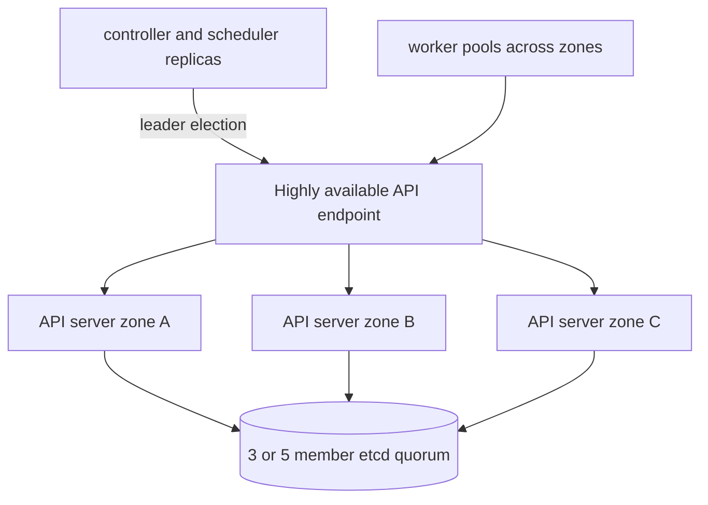

# Day 29 · High availability, backup, upgrades, and capacity

## Outcome

Design a production maintenance plan that respects failure domains, quorum, version skew, API compatibility, rollback limits, and workload disruption.



High availability removes single failures, not correlated ones. Spread API servers and etcd members across independent failure domains with low, predictable latency. Use an API load balancer with meaningful health checks. Scheduler and controller replicas rely on leader election. Preserve enough worker capacity per zone for rescheduling while honoring spread, PDBs, storage topology, and quotas.

## Upgrade planning

1. Read release notes, deprecations, urgent CVEs, and distribution-specific instructions for every intermediate version.
2. Inventory clients, add-ons, CRDs/webhooks, deprecated APIs, CNI/CSI, ingress, metrics, operators, and node OS/runtime support.
3. Verify recent etcd/config/PKI backups with a tested restore.
4. Test representative workloads and rollback boundaries in staging/canary.
5. Upgrade control plane per supported skew/order, then node pools gradually.
6. Cordon/drain respecting PDB and capacity; validate DNS, networking, storage, admission, scheduling, metrics, logs, and SLOs after each batch.
7. Stop on explicit error/SLO thresholds. Know that etcd/schema/data migrations may make “rollback binary” insufficient.

Never infer current version-skew policy from memory; check the official policy for the target release and your managed service.

## Lab · Preflight an upgrade

```console
kubectl version
kubectl get nodes -o custom-columns=NAME:.metadata.name,KUBELET:.status.nodeInfo.kubeletVersion,RUNTIME:.status.nodeInfo.containerRuntimeVersion,OS:.status.nodeInfo.osImage
kubectl api-versions
kubectl get apiservice
kubectl get crd
kubectl get mutatingwebhookconfiguration,validatingwebhookconfiguration
kubectl get pdb -A
kubectl get storageclass,csidriver
kubectl get daemonset -A
kubectl auth can-i --list
```

Create an upgrade risk table with owner, compatibility evidence, test, rollback, and stop signal for every add-on. On a disposable multi-node lab, rehearse one worker:

```console
kubectl cordon <worker>
kubectl drain <worker> --ignore-daemonsets --delete-emptydir-data --timeout=5m
# perform the distribution-supported node upgrade here
kubectl uncordon <worker>
kubectl get node <worker>
```

No upgrade is complete until workloads, network, storage, DNS, security admission, autoscaling, and telemetry pass tests.

## Backup and restore scope

- etcd/API state plus encryption configuration/keys and required PKI.
- Persistent application data through storage-native, application-consistent backup.
- Declarative source, images/charts, external DNS/LB/IAM/KMS configuration, and operator-managed external state.
- Documented bootstrap and restore ordering.

An etcd snapshot does not back up the contents of PVs. GitOps does not back up runtime data. A backup is unproven until a timed restore validates integrity and dependency ordering.

## Capacity and failure domains

Budget requested CPU/memory and IP/storage quotas for normal load **plus** one failure domain, rolling surge, DaemonSets, system reservations, and autoscaler latency. Monitor request saturation separately from utilization. Ensure PDB/spread rules remain feasible during planned and unplanned loss.

## Interview practice

1. Design an HA control plane and explain etcd quorum.
2. Give a safe cluster upgrade plan and stop/rollback criteria.
3. What does an etcd snapshot not protect?
4. How do PDB, topology spread, and capacity interact during maintenance?
5. What is Kubernetes version skew and why verify current policy?
6. How do you test disaster recovery rather than merely test backup creation?

