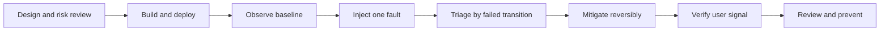

# Day 30 · Capstone incident and senior mock interview

## Outcome

Demonstrate the complete senior workflow: design, deploy, observe, inject faults, recover, explain tradeoffs, and produce an incident review.



## Part 1 · Build the platform (30 minutes)

On a disposable cluster:

```console
helm upgrade --install k8s-30d labs/kubernetes-internals --namespace default --set labs.web.enabled=true --set labs.rbac.enabled=true --set labs.scalingReliability.enabled=true
kubectl get deployment,service,pod,hpa,pdb -n k8s-30d
kubectl rollout status deployment/web -n k8s-30d
```

Produce a baseline transcript:

```console
kubectl get pod -n k8s-30d -o wide
kubectl get endpointslice -n k8s-30d
kubectl top pod -n k8s-30d
kubectl auth can-i create pods -n k8s-30d --as=system:serviceaccount:k8s-30d:pod-reader
kubectl run capstone-client -n k8s-30d --image=nicolaka/netshoot --restart=Never -- sleep 1d
kubectl exec capstone-client -n k8s-30d -- curl -sS http://web
```

Draw the actual path from client to Pod, including your CNI/service implementation and node placement.

## Part 2 · Blind incident (25 minutes)

Have another person choose one injection, or choose a number randomly and reveal only the command:

```console
# 1: Service has no endpoints
kubectl patch service web -n k8s-30d --type=merge -p '{"spec":{"selector":{"app":"wrong"}}}'

# 2: rollout cannot pull
kubectl set image deployment/web -n k8s-30d nginx=invalid.example.invalid/web:nope

# 3: replicas cannot schedule
kubectl patch deployment web -n k8s-30d --type=merge -p '{"spec":{"template":{"spec":{"nodeSelector":{"capstone":"missing"}}}}}'

# 4: liveness causes restart storm
kubectl patch deployment web -n k8s-30d --type=json -p='[{"op":"replace","path":"/spec/template/spec/containers/0/livenessProbe/httpGet/path","value":"/not-ready"}]'
```

Rules:

1. State impact and scope before changing anything.
2. Use no more than eight diagnostic commands.
3. Record one hypothesis disproved by evidence.
4. Mitigate through the owning Deployment/Service, not by repeatedly deleting Pods.
5. Verify the client HTTP response, ready endpoints, rollout, and events.

The universal reset is:

```console
helm upgrade k8s-30d labs/kubernetes-internals --namespace default --reuse-values --set labs.web.enabled=true
kubectl rollout status deployment/web -n k8s-30d --timeout=2m
kubectl exec capstone-client -n k8s-30d -- curl -sS http://web
```

## Part 3 · Production design review (20 minutes)

Present a design for a three-zone customer API with:

- API replicas and zone/node topology spread;
- requests, limits, HPA signal, minimum/maximum replicas, and spare capacity;
- readiness/startup/liveness semantics and graceful shutdown;
- PDB and deployment surge/unavailable math;
- least-privilege identity, Pod Security, secret delivery, NetworkPolicy;
- persistent dependency backup/restore and zone topology;
- RED application SLOs plus cluster/node/DNS/storage signals;
- deployment, canary/rollback, upgrade, and disaster recovery procedures.

Every choice must include a failure it prevents and a failure it can introduce.

## Part 4 · 60-minute mock interview

| Minutes | Area | Prompt |
|---:|---|---|
| 0-10 | architecture | Trace Deployment creation to ready Service endpoint |
| 10-20 | internals | etcd quorum, scheduler pipeline, kubelet/CRI/CNI/CSI |
| 20-30 | networking | Debug DNS/Service/Ingress failure layer by layer |
| 30-40 | reliability/security | rollout, probes, PDB, RBAC, admission, policy |
| 40-50 | incident | API latency or Node NotReady scenario |
| 50-60 | design | HA multi-zone platform, upgrade, backup, observability |

Score each answer 0-2 on mechanism, evidence, mitigation, tradeoff, and prevention. A strong answer scores at least 8/10 without unsupported certainty.

## Incident review deliverable

Write one page:

- executive impact and duration;
- detection and precise timeline;
- architecture/request path;
- proximate trigger and contributing systemic causes;
- evidence supporting the cause;
- mitigation and recovery validation;
- what went well/poorly;
- prioritized actions with owner, date, and verification method.

Avoid “human error” as a root cause. Ask why one action could bypass validation, produce a broad blast radius, or remain undetected.

## Graduation checklist

- Explain every arrow in the Day 3 request-flow diagram.
- Repair all four Day 26 failures without reading their YAML first.
- Diagnose network failures from Pod listener outward.
- Explain one real production incident with evidence and tradeoffs.
- Answer at least 40 questions in the [interview bank](../reference/interview-bank.md) aloud.
- Repeat the capstone after one week; target faster diagnosis with fewer commands.
