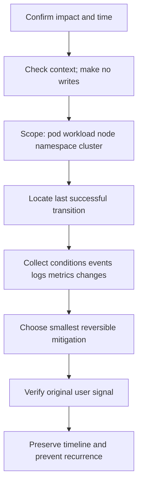

# Production troubleshooting runbook

## The first five minutes



Ask:

1. What user-visible behavior is broken, since when, and how severe?
2. What changed near the start: deploy, config, policy, certificate, node, add-on, traffic?
3. Is scope one replica, revision, node, zone, namespace, service, or whole cluster?
4. What is the last transition that definitely succeeded?
5. Which observation would disprove the leading hypothesis?

Avoid unbounded dumps during control-plane distress and avoid restarts that destroy evidence.

## Pod Pending

```powershell
kubectl get pod <pod> -n <ns> -o wide
kubectl describe pod <pod> -n <ns>
kubectl get events -n <ns> --field-selector involvedObject.name=<pod>
kubectl get node
kubectl get pvc -n <ns>
```

Branches: requests vs allocatable, node selector/affinity, taints, topology spread, host ports, PVC binding/topology, quota, scheduler leader/queue. A missing `spec.nodeName` keeps the incident before kubelet.

## ContainerCreating

Read events for `FailedCreatePodSandBox`, image pull, volume attach/mount, CNI, Secret/ConfigMap, or runtime errors. Inspect node, kubelet/runtime, CNI/CSI agents. Application logs may not exist because no process started.

## CrashLoopBackOff

```powershell
kubectl get pod <pod> -n <ns> -o yaml
kubectl logs <pod> -n <ns> -c <container> --previous --timestamps
kubectl describe pod <pod> -n <ns>
kubectl top pod <pod> -n <ns> --containers
```

Branches: application exit code/config/dependency, liveness failure, OOM, permissions/read-only filesystem, missing mount, architecture, command/entrypoint. Compare healthy replica/revision. Repair the controller template or roll back.

## ImagePullBackOff

The event distinguishes invalid reference/tag/digest, unauthorized pull, missing pull Secret, registry DNS/TLS/network, throttling/quota, and platform mismatch. Verify from the node runtime path—not only your laptop. Pin reviewed digests where supply-chain policy requires.

## OOMKilled and memory pressure

- Container OOM: `lastState.terminated.reason=OOMKilled`, usually cgroup limit.
- Node pressure eviction: Pod reason/events and node `MemoryPressure`/eviction messages.
- Host/system OOM: kernel logs may show victim; status may be less clear after node failure.

Measure working set, heap/native/cache, leaks, concurrency, limit/request, QoS, node reservations, and peak distribution. Increasing limits without capacity analysis can transfer failure to the node.

## Node NotReady

Check Node conditions/pressure, Lease renewal, assigned Pods, node events, kubelet/runtime services, disk/inodes, certificates, API path, CNI/CSI. Cordon while investigating if possible. Decide fencing before rescheduling stateful writers.

## Service unreachable

1. Curl the application locally/in Pod if meaningful.
2. Curl Pod IP and `targetPort` from the affected caller context.
3. Check EndpointSlice addresses/readiness.
4. Check Service selector, `port`, `targetPort`, IP family.
5. Curl ClusterIP.
6. Resolve and curl DNS name.
7. Inspect NetworkPolicy, mesh, kube-proxy/eBPF, conntrack, node path.

## DNS failure

Inspect caller `/etc/resolv.conf`; query short name, FQDN, cluster DNS IP directly, and an external name; inspect DNS Service/EndpointSlice/Pods/logs/metrics; check UDP/TCP 53 policy, upstream reachability, node-local cache, search/`ndots`, throttling, and conntrack.

## PVC Pending

Inspect PVC events/class/access/size/volume mode, default StorageClass, binding mode, consuming Pod, provisioner logs, capacity and allowed topology. With `WaitForFirstConsumer`, a claim can legitimately wait for a schedulable consumer.

## Volume attach or mount failure

Inspect Pod events, PV CSI handle, VolumeAttachment, prior node, CSI controller/node logs, kubelet, backend attachment, filesystem, node plugin registration, and secrets. Protect against two writers and unsafe force-detach.

## Rolling update stuck

```powershell
kubectl describe deployment <name> -n <ns>
kubectl get replicaset,pod -n <ns> -l <selector> -o wide
kubectl rollout history deployment/<name> -n <ns>
kubectl get events -n <ns> --sort-by='.metadata.creationTimestamp'
```

Check image/config, scheduling capacity, surge/unavailable math, quota, readiness/startup, PDB/affinity, PVC, and progress deadline. Stop/rollback based on user signal; remember data/schema changes may not roll back.

## Ingress 404, 502, or TLS

- 404/default backend: class, host/path match, loaded controller configuration.
- 502/503: backend Service/EndpointSlice, target port/protocol, readiness, policy/mesh, controller reachability.
- TLS: DNS/SNI, certificate SAN/chain/expiry, Secret namespace/key pair, controller reload, LB/controller termination boundary.

## High API server latency

Break down request duration by verb/resource/status and inspect inflight/APF queues, 429s, admission webhook latency/failures, etcd request/commit/disk latency, LIST/watch cardinality, audit pipeline, encryption/KMS, API CPU/memory/GC, LB/network. Identify abusive clients before scaling blindly.

## etcd full, slow, or unavailable

Confirm member/quorum/leader, alarms, database/quota, disk latency/capacity, request duration, and network. Stop object churn, preserve a snapshot, compact/defragment only per quorum-safe runbook, and repair the producer. Restore from a tested snapshot with encryption/PKI and revision-aware procedure.

## Scheduler not scheduling

If Pods receive detailed `FailedScheduling`, the scheduler is operating and reporting constraints. If events/bindings stop, inspect leader Lease, logs/metrics, API connectivity, queue depth/attempt duration, plugins/extenders, and configuration. Quantify reasons across all Pending Pods.

## kube-proxy or dataplane CPU high

Check Service/EndpointSlice churn and cardinality, sync duration/failures, mode/config, iptables/IPVS/eBPF state, conntrack, short-lived connections, and controllers producing endpoint storms. Compare affected nodes and recent changes before restart.

## Post-incident standard

Record impact, detection, timeline, architecture path, trigger, contributing control gaps, evidence, mitigation, recovery proof, and actions with owners/dates/verification. Prefer systemic causes over blame. Test the runbook through a game day.

